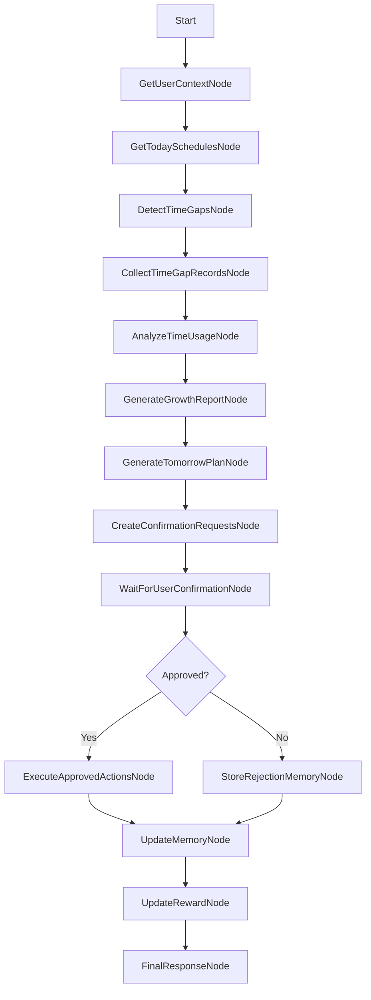

# 하루톡톡 완전한 AI Agent 서비스 재설계서

## 1. 하루톡톡의 최종 Agent 서비스 정의

하루톡톡은 사용자의 목표, 일정, 반복 루틴, 빈 시간 기록, 하루 평가, 완료율, 생활 패턴을 관찰하고 분석한 뒤 다음 행동을 계획하며, 사용자 승인 후 실제 캘린더와 체크리스트를 수정하고, 그 결과를 Memory에 저장해 다음 추천에 반영하는 AI Agent 기반 성장형 일정관리 서비스다.

하루톡톡의 핵심은 캘린더 UI가 아니라 다음 루프다.

1. Observe: 사용자의 일정, 목표, 빈 시간, 완료율, 생활 패턴을 관찰한다.
2. Analyze: 시간 사용, 목표 달성, 미완료 일정, 반복 실패 패턴을 분석한다.
3. Plan: 내일 또는 다음 주의 구체적인 행동 계획을 만든다.
4. Confirm: 일정과 체크리스트를 바꾸기 전 사용자 승인을 받는다.
5. Act: 승인된 작업만 실제 캘린더, 체크리스트, 알림에 반영한다.
6. Remember: 실행 결과와 승인/거절 패턴을 Memory에 저장한다.
7. Improve: 다음 추천에서 Memory를 반영해 더 개인화한다.

서비스 한 줄 정의:

> 하루톡톡은 단순 캘린더 앱이 아니라, 사용자의 하루를 관찰하고 시간 사용을 분석한 뒤 다음 일정을 계획하고 사용자 승인 후 실제 캘린더에 반영하는 AI Agent 기반 성장형 일정관리 서비스다.

## 2. 기존 일정관리 앱과의 차별점

| 구분 | 일반 캘린더 앱 | 하루톡톡 |
| --- | --- | --- |
| 입력 방식 | 사용자가 직접 일정 입력 | 자연어, 음성, 반복 루틴, 빈 시간 기록 |
| 분석 범위 | 등록된 일정 중심 | 일정, 빈 시간, 완료율, 목표, 생활 패턴 |
| AI 역할 | 일정 요약 또는 간단 추천 | Observe, Analyze, Plan, Confirm, Act, Remember |
| 실행 방식 | 사용자가 직접 수정 | AI가 제안하고 사용자 승인 후 실행 |
| 개인화 | 반복 일정 저장 수준 | 승인/거절, 실패 시간대, 성공 루틴 Memory 반영 |
| 성장 요소 | 없음 또는 통계 | 성장보고서, 배지, 연속 달성, 성장 잔디 |

하루톡톡은 "무엇이 예정되어 있는가"보다 "오늘을 어떻게 보냈고 내일 무엇을 바꾸면 좋은가"에 집중한다.

## 3. 완전한 AI Agent로 동작하는 핵심 루프

### 3.1 Observe

관찰 데이터:

- 오늘 일정
- 내일 일정
- 반복 일정
- 중요한 일정과 D-Day
- 일정 완료 여부
- 하루 시작 시간과 종료 시간
- 일정 사이 빈 시간
- 빈 시간 기록
- 하루 만족도
- 단기 목표와 장기 목표
- 최근 7일 또는 14일 시간 사용 패턴
- 배지, 연속 달성, 성장 잔디 기록

완료 기준:

- 사용자가 하루 성장보고서 화면에 들어오면 오늘 일정과 빈 시간이 자동 계산된다.
- 캘린더에 등록된 일정만이 아니라 미기록 빈 시간도 Observe 대상에 포함된다.

### 3.2 Analyze

분석 항목:

- 일정 완료율
- 미완료 일정
- 빈 시간 총합
- 기록된 빈 시간과 기록되지 않은 빈 시간
- 이동, 식사, 휴식, SNS/영상/게임, 공부, 자기개발, 운동, 대기 시간
- 목표 관련 시간 확보 여부
- 시간 낭비 가능 구간
- 반복적으로 실패하는 시간대
- 집중이 잘 되는 시간대
- 일정 과부하 여부

점수 계산:

- 일정 완료율: 40점
- 목표 관련 시간 확보: 20점
- 시간 낭비 가능 구간 관리: 20점
- 기록 성실도: 10점
- 하루 만족도: 10점

### 3.3 Plan

계획 예시:

- 미완료 일정을 내일 빈 시간에 재배치
- 장기 목표 관련 일정 30분 추가
- 이동시간에 영어 듣기 루틴 추가
- SNS 시간이 긴 날에는 대체 활동 제안
- 식사시간이 긴 날에는 식사 후 짧은 공부 일정 제안
- 공부 완료율이 높은 시간대에 중요한 공부 일정 우선 배치
- 다음 주 추천 루틴 생성

### 3.4 Confirm

승인이 필요한 작업:

- 일정 생성
- 일정 수정
- 일정 삭제
- 미완료 일정 재배치
- 반복 루틴 추가
- 알림 생성
- 체크리스트 자동 생성
- 다음 주 추천 루틴 반영

원칙:

- AI는 캘린더를 임의로 바꾸지 않는다.
- 사용자가 명시적으로 승인한 작업만 실행한다.
- 승인 요청은 이유, 시간, 실행 방식이 함께 표시되어야 한다.

### 3.5 Act

실행 대상:

- 내부 캘린더 일정 생성, 수정, 삭제
- Google Calendar 일정 생성, 수정, 삭제
- 체크리스트 생성
- 하루 평가 알림 생성
- 반복 루틴 생성
- 배지 지급
- 성장 잔디 업데이트

### 3.6 Remember

Memory 저장 대상:

- 자주 미루는 일정
- 잘 완료하는 시간대
- 실패하는 시간대
- 이동시간이 많은 요일
- 식사시간이 길어지는 패턴
- SNS/영상 시간이 길어지는 시간대
- 목표 관련 시간이 부족한 패턴
- 사용자가 승인한 제안
- 사용자가 거절한 제안
- 성공한 루틴
- 실패한 루틴

### 3.7 Improve

예시:

> 최근 2주 동안 저녁 9시 이후 공부 일정 완료율은 28%였고, 오전 9시~11시 공부 일정 완료율은 76%였습니다. 앞으로 자격증 공부 일정은 오전 시간대에 우선 배치할까요?

## 4. Multi-Agent 아키텍처

### 4.1 Orchestrator Agent

역할:

- 사용자 입력 의도 분류
- 필요한 하위 Agent 호출
- 전체 Agent 루프 제어
- 승인 필요 여부 판단

Intent:

- CREATE_EVENT
- UPDATE_EVENT
- DELETE_EVENT
- SEARCH_EVENT
- COMPLETE_EVENT
- DAILY_REVIEW
- DETECT_TIME_GAPS
- SAVE_TIME_GAP_RECORD
- GENERATE_GROWTH_REPORT
- GENERATE_TOMORROW_PLAN
- CONFIRM_ACTION
- REJECT_ACTION
- UPDATE_MEMORY
- GENERAL_CHAT

### 4.2 Goal Agent

역할:

- 단기 목표 관리
- 장기 목표 관리
- 목표 관련 일정 판단
- 목표 관련 시간 부족 여부 분석
- 목표와 연결된 내일 일정 제안

### 4.3 Calendar Agent

역할:

- 일정 조회
- 일정 생성
- 일정 수정
- 일정 삭제
- 일정 완료 처리
- 일정 충돌 감지
- 대체 시간 추천
- Google Calendar 연동

### 4.4 Time Gap Agent

역할:

- 일정 사이 빈 시간 자동 감지
- 15분 미만 빈 시간 제외
- 겹치는 일정 충돌 표시
- 빈 시간 카드 생성
- 빈 시간 기록 저장

### 4.5 Time Usage Agent

역할:

- 빈 시간 기록 분석
- 카테고리별 시간 합산
- 시간 사용 점수 계산
- 이동, 식사, SNS/영상, 공부, 자기개발 시간 분석
- 시간 낭비 가능 구간 판단

### 4.6 Planning Agent

역할:

- 미완료 일정 재배치안 생성
- 내일 일정 개선안 생성
- 목표 관련 일정 제안
- 루틴 생성 제안
- 내일 추천 시간 배치 생성
- 승인 요청 후보 생성

### 4.7 Confirmation Agent

역할:

- 사용자 승인 요청 생성
- 승인/거절 상태 관리
- 승인된 작업만 실행 Agent로 전달
- 거절 사유를 Memory 후보로 저장

### 4.8 Memory Agent

역할:

- 생활 패턴 저장
- 성공/실패 패턴 저장
- 사용자 승인/거절 패턴 저장
- 다음 추천에 Memory 반영

### 4.9 Reward Agent

역할:

- 배지 지급
- 연속 달성 기록 업데이트
- 성장 잔디 업데이트
- 주간 빙고 업데이트

### 4.10 Fortune Agent

역할:

- 오늘의 톡톡 운세 생성
- 오늘의 작은 미션 생성
- 일정 기반 가벼운 조언 제공
- 운세 피드백을 다음 톤에 반영

## 5. LangGraph 기준 노드 구조

### 5.1 하루 성장보고서 Agent Flow



### 5.2 노드별 입출력

| Node | 입력 | 출력 |
| --- | --- | --- |
| GetUserContextNode | user_id | preferences, goals, memory, rewards |
| GetTodaySchedulesNode | user_id, date | schedules, completed, incomplete |
| DetectTimeGapsNode | schedules, day_start, day_end | time_gaps |
| CollectTimeGapRecordsNode | time_gaps | recorded_time_gaps |
| AnalyzeTimeUsageNode | schedules, time_gaps, satisfaction | time_usage_summary |
| GenerateGrowthReportNode | context, summary | growth_report |
| GenerateTomorrowPlanNode | growth_report, tomorrow_slots | tomorrow_plan |
| CreateConfirmationRequestsNode | tomorrow_plan | confirmation_requests |
| WaitForUserConfirmationNode | confirmation_requests | approved/rejected |
| ExecuteApprovedActionsNode | approved actions | calendar/checklist changes |
| UpdateMemoryNode | analysis, result | user_memory |
| UpdateRewardNode | review result | badges, streak, grass |
| FinalResponseNode | all outputs | user-facing response |

## 6. 데이터베이스 설계

### 6.1 users

| 필드 | 타입 | 설명 |
| --- | --- | --- |
| id | uuid | 사용자 ID |
| nickname | text | 닉네임 |
| email | text | 이메일 |
| birth_date | date nullable | 생년월일 |
| birth_calendar_type | enum(solar,lunar) | 양력/음력 |
| birth_time | text nullable | 출생 시간 |
| day_start_time | time | 하루 시작 시간 |
| day_end_time | time | 하루 종료 시간 |
| fortune_enabled | boolean | 운세 사용 여부 |
| created_at | timestamptz | 생성 시각 |

### 6.2 goals

| 필드 | 타입 | 설명 |
| --- | --- | --- |
| id | uuid | 목표 ID |
| user_id | uuid | 사용자 ID |
| title | text | 목표명 |
| type | enum(short_term,long_term) | 목표 유형 |
| category | text | 공부, 운동, 프로젝트 등 |
| target_date | date nullable | 목표일 |
| status | enum(active,done,paused,archived) | 상태 |
| created_at | timestamptz | 생성 시각 |

### 6.3 schedules

| 필드 | 타입 | 설명 |
| --- | --- | --- |
| id | uuid | 일정 ID |
| user_id | uuid | 사용자 ID |
| title | text | 일정 제목 |
| category | text nullable | 카테고리 |
| start_time | timestamptz | 시작 시간 |
| end_time | timestamptz | 종료 시간 |
| repeat_rule | jsonb nullable | 반복 규칙 |
| is_important | boolean | 중요 일정 여부 |
| is_completed | boolean | 완료 여부 |
| memo | text nullable | 메모 |
| audio_url | text nullable | 녹음 파일 URL |
| ai_summary | text nullable | AI 요약 |
| google_event_id | text nullable | Google Calendar 이벤트 ID |
| created_at | timestamptz | 생성 시각 |

### 6.4 time_gaps

| 필드 | 타입 | 설명 |
| --- | --- | --- |
| id | uuid | 빈 시간 ID |
| user_id | uuid | 사용자 ID |
| date | date | 기준 날짜 |
| start_time | timestamptz | 시작 시간 |
| end_time | timestamptz | 종료 시간 |
| duration_minutes | integer | 소요 분 |
| category | text nullable | 빈 시간 카테고리 |
| memo | text nullable | 사용자 메모 |
| is_recorded | boolean | 기록 여부 |
| created_at | timestamptz | 생성 시각 |
| updated_at | timestamptz | 수정 시각 |

### 6.5 time_usage_summary

| 필드 | 타입 | 설명 |
| --- | --- | --- |
| id | uuid | 분석 ID |
| user_id | uuid | 사용자 ID |
| date | date | 기준 날짜 |
| total_schedule_minutes | integer | 전체 일정 시간 |
| completed_schedule_minutes | integer | 완료 일정 시간 |
| unrecorded_gap_minutes | integer | 미기록 빈 시간 |
| moving_minutes | integer | 이동 시간 |
| meal_minutes | integer | 식사 시간 |
| rest_minutes | integer | 휴식 시간 |
| self_development_minutes | integer | 자기개발 시간 |
| study_minutes | integer | 공부 시간 |
| exercise_minutes | integer | 운동 시간 |
| sns_video_minutes | integer | SNS/영상/게임 시간 |
| waiting_minutes | integer | 대기 시간 |
| etc_minutes | integer | 기타 시간 |
| time_usage_score | integer | 시간 사용 점수 |
| ai_feedback | text | AI 피드백 |
| created_at | timestamptz | 생성 시각 |

### 6.6 confirmation_requests

| 필드 | 타입 | 설명 |
| --- | --- | --- |
| id | uuid | 승인 요청 ID |
| user_id | uuid | 사용자 ID |
| source_type | text | growth_report, chat, meeting 등 |
| action_type | text | create, update, delete, reschedule, routine, reminder |
| title | text | 제안 제목 |
| reason | text | 제안 이유 |
| proposed_start_time | timestamptz nullable | 제안 시작 |
| proposed_end_time | timestamptz nullable | 제안 종료 |
| payload | jsonb | 실행 payload |
| status | enum(pending,approved,rejected,executed) | 상태 |
| created_at | timestamptz | 생성 시각 |
| resolved_at | timestamptz nullable | 승인/거절 시각 |

### 6.7 user_memory

| 필드 | 타입 | 설명 |
| --- | --- | --- |
| id | uuid | Memory ID |
| user_id | uuid | 사용자 ID |
| memory_type | text | moving_pattern, sns_pattern, accepted_suggestion 등 |
| memory_content | text | 저장 내용 |
| confidence | numeric | 신뢰도 |
| source_date | date | 근거 날짜 |
| created_at | timestamptz | 생성 시각 |

### 6.8 rewards

badges:

- id
- name
- description
- condition
- icon
- created_at

user_badges:

- id
- user_id
- badge_id
- earned_at

habit_grass:

- id
- user_id
- date
- category
- completed_count
- intensity

### 6.9 daily_reviews, daily_fortunes

daily_reviews:

- id
- user_id
- review_date
- completed_schedule_count
- total_schedule_count
- satisfaction
- memo
- ai_review
- created_at

daily_fortunes:

- id
- user_id
- fortune_date
- summary
- recommended_action
- caution
- lucky_category
- mission
- ai_fortune_text
- user_feedback
- created_at

## 7. API 설계

### 7.1 인증/사용자

- POST `/auth/google`: Google OAuth 시작
- GET `/user/profile`: 사용자 프로필 조회
- PATCH `/user/profile`: 닉네임, 생일, 출생 시간 수정
- GET `/user/preferences`: 하루 시작/종료, 운세 설정 조회
- PATCH `/user/preferences`: 사용자 설정 수정

### 7.2 목표

- GET `/goals`
- POST `/goals`
- PATCH `/goals/{goal_id}`
- DELETE `/goals/{goal_id}`

### 7.3 일정

- GET `/schedules`
- POST `/schedules`
- PATCH `/schedules/{schedule_id}`
- DELETE `/schedules/{schedule_id}`
- POST `/schedules/{schedule_id}/complete`
- POST `/schedules/{schedule_id}/memo`
- POST `/schedules/{schedule_id}/audio`
- POST `/schedules/{schedule_id}/summarize`

### 7.4 빈 시간/성장보고서

- GET `/daily-review/time-gaps`
- POST `/daily-review/time-gaps`
- POST `/daily-review/analyze-time-usage`
- POST `/daily-review/growth-report`
- POST `/daily-review/tomorrow-plan`

### 7.5 승인 요청

- GET `/confirmation-requests`
- POST `/confirmation-requests`
- POST `/confirmation-requests/{id}/approve`
- POST `/confirmation-requests/{id}/reject`

### 7.6 Memory

- GET `/memory`
- POST `/memory`
- PATCH `/memory/{memory_id}`

### 7.7 보상

- GET `/badges`
- GET `/habit-grass`
- POST `/reward/update`

### 7.8 운세

- GET `/fortune/today`
- POST `/fortune/generate`
- POST `/fortune/feedback`

## 8. Tool Function Schema

### 8.1 get_user_context

description: 사용자 목표, 선호 시간, 최근 Memory, 보상 상태를 조회한다.

parameters:

```json
{
  "user_id": "local-user",
  "date": "2026-06-29",
  "lookback_days": 14
}
```

required: `user_id`, `date`

example output:

```json
{
  "preferences": { "day_start_time": "07:00", "day_end_time": "23:00" },
  "goals": [{ "title": "산업안전기사 합격", "type": "long_term" }],
  "memory": [{ "memory_type": "focus_pattern", "memory_content": "오전 공부 완료율이 높음" }],
  "rewards": { "streak_days": 3 }
}
```

### 8.2 get_calendar_events

description: 기간 내 캘린더 일정을 조회한다.

parameters:

```json
{
  "user_id": "local-user",
  "start_time": "2026-06-29T00:00:00+09:00",
  "end_time": "2026-06-29T23:59:59+09:00"
}
```

required: `user_id`, `start_time`, `end_time`

example output:

```json
{
  "events": [
    { "id": "sch_1", "title": "운동", "start_time": "2026-06-29T15:00:00+09:00", "end_time": "2026-06-29T18:00:00+09:00" }
  ]
}
```

### 8.3 create_calendar_event

description: 승인된 일정 생성 작업을 실행한다.

parameters:

```json
{
  "user_id": "local-user",
  "title": "목표 관련 집중 30분",
  "start_time": "2026-06-30T09:00:00+09:00",
  "end_time": "2026-06-30T09:30:00+09:00",
  "category": "공부",
  "source": "growth_report"
}
```

required: `user_id`, `title`, `start_time`, `end_time`

example output:

```json
{ "event_id": "sch_123", "status": "created" }
```

### 8.4 update_calendar_event

description: 승인된 일정 수정 작업을 실행한다.

parameters:

```json
{
  "user_id": "local-user",
  "event_id": "sch_123",
  "patch": { "start_time": "2026-06-30T10:00:00+09:00" }
}
```

required: `user_id`, `event_id`, `patch`

example output:

```json
{ "event_id": "sch_123", "status": "updated" }
```

### 8.5 delete_calendar_event

description: 승인된 일정 삭제 작업을 실행한다.

parameters:

```json
{ "user_id": "local-user", "event_id": "sch_123" }
```

required: `user_id`, `event_id`

example output:

```json
{ "event_id": "sch_123", "status": "deleted" }
```

### 8.6 detect_time_gaps

description: 오늘 일정 사이의 빈 시간을 감지한다.

parameters:

```json
{
  "user_id": "local-user",
  "date": "2026-06-29",
  "day_start_time": "07:00",
  "day_end_time": "23:00",
  "min_minutes": 15
}
```

required: `user_id`, `date`, `day_start_time`, `day_end_time`

example output:

```json
{
  "time_gaps": [
    { "id": "gap_1", "start_time": "08:00", "end_time": "10:00", "duration_minutes": 120 }
  ]
}
```

### 8.7 save_time_gap_record

description: 사용자가 입력한 빈 시간 기록을 저장한다.

parameters:

```json
{
  "user_id": "local-user",
  "date": "2026-06-29",
  "time_gap_id": "gap_1",
  "category": "moving",
  "memo": "학교 이동",
  "is_recorded": true
}
```

required: `user_id`, `date`, `time_gap_id`, `is_recorded`

example output:

```json
{ "time_gap_id": "gap_1", "status": "saved" }
```

### 8.8 analyze_time_usage

description: 일정과 빈 시간 기록을 바탕으로 하루 시간 사용을 분석한다.

parameters:

```json
{
  "user_id": "local-user",
  "date": "2026-06-29",
  "satisfaction": 7
}
```

required: `user_id`, `date`

example output:

```json
{
  "time_usage_score": 78,
  "moving_minutes": 140,
  "sns_video_minutes": 90,
  "ai_feedback": "오늘은 이동시간이 긴 편입니다."
}
```

### 8.9 generate_growth_report

description: 하루 성장보고서를 생성한다.

parameters:

```json
{
  "user_id": "local-user",
  "date": "2026-06-29",
  "time_usage_summary_id": "usage_1"
}
```

required: `user_id`, `date`, `time_usage_summary_id`

example output:

```json
{
  "report": {
    "summary": "오늘은 일정 수행은 안정적이었지만 목표 관련 시간이 부족했습니다.",
    "strengths": ["빈 시간 기록을 완료했습니다."],
    "improvements": ["내일 오전 목표 일정 30분을 확보해보세요."]
  }
}
```

### 8.10 generate_tomorrow_plan

description: 성장보고서를 바탕으로 내일 개선안을 만든다.

parameters:

```json
{
  "user_id": "local-user",
  "date": "2026-06-29",
  "unfinished_schedule_ids": ["sch_1"]
}
```

required: `user_id`, `date`

example output:

```json
{
  "plans": [
    {
      "title": "산업안전기사 공부",
      "start_time": "2026-06-30T09:00:00+09:00",
      "end_time": "2026-06-30T10:00:00+09:00",
      "requires_confirmation": true
    }
  ]
}
```

### 8.11 create_confirmation_request

description: 사용자 승인 필요한 작업을 생성한다.

parameters:

```json
{
  "user_id": "local-user",
  "source_type": "growth_report",
  "action_type": "create",
  "title": "목표 관련 집중 30분",
  "reason": "오늘 목표 관련 시간이 30분 미만이었습니다.",
  "proposed_start_time": "2026-06-30T09:00:00+09:00",
  "proposed_end_time": "2026-06-30T09:30:00+09:00",
  "payload": { "category": "공부" }
}
```

required: `user_id`, `source_type`, `action_type`, `title`, `reason`

example output:

```json
{ "confirmation_request_id": "conf_1", "status": "pending" }
```

### 8.12 execute_calendar_action

description: 승인된 캘린더 작업을 실행한다.

parameters:

```json
{
  "user_id": "local-user",
  "confirmation_request_id": "conf_1"
}
```

required: `user_id`, `confirmation_request_id`

example output:

```json
{ "status": "executed", "event_id": "sch_123" }
```

### 8.13 update_user_memory

description: 시간 사용 패턴과 승인/거절 결과를 Memory에 저장한다.

parameters:

```json
{
  "user_id": "local-user",
  "memory_type": "accepted_suggestion",
  "memory_content": "목표 관련 집중 30분 오전 배치를 승인함",
  "confidence": 0.8,
  "source_date": "2026-06-29"
}
```

required: `user_id`, `memory_type`, `memory_content`, `source_date`

example output:

```json
{ "memory_id": "mem_1", "status": "saved" }
```

### 8.14 update_reward_status

description: 하루 평가 완료, 연속 달성, 배지, 성장 잔디 상태를 업데이트한다.

parameters:

```json
{
  "user_id": "local-user",
  "date": "2026-06-29",
  "completed_count": 3,
  "total_count": 4,
  "time_usage_score": 78,
  "categories_completed": ["study", "exercise"]
}
```

required: `user_id`, `date`

example output:

```json
{ "streak_days": 4, "earned_badges": ["빈 시간 기록 완료"] }
```

### 8.15 generate_today_fortune

description: 오늘 일정 기반 운세와 작은 미션을 생성한다.

parameters:

```json
{ "user_id": "local-user", "fortune_date": "2026-06-29" }
```

required: `user_id`, `fortune_date`

example output:

```json
{
  "summary": "오늘은 작게 시작한 일이 좋은 흐름으로 이어질 수 있는 날이에요.",
  "mission": "중요 일정 하나를 먼저 완료해보세요."
}
```

### 8.16 summarize_schedule_memo

description: 일정 메모와 녹음 전사 텍스트를 요약하고 후속 일정을 제안한다.

parameters:

```json
{
  "user_id": "local-user",
  "schedule_id": "sch_1",
  "memo": "회의에서 발표자료 초안을 금요일까지 만들기로 함",
  "transcript": "민수가 초안을 작성하고 지영이 디자인을 정리하기로 했다."
}
```

required: `user_id`, `schedule_id`

example output:

```json
{
  "summary": "발표자료 초안 작성과 디자인 정리를 논의했습니다.",
  "action_items": ["발표자료 초안 작성", "디자인 정리"],
  "schedule_candidates": [{ "title": "발표자료 초안 작성", "requires_confirmation": true }]
}
```

## 9. Agent별 프롬프트

### 9.1 System Prompt

```text
너는 하루톡톡의 AI Agent 시스템이다.
하루톡톡은 사용자의 목표, 일정, 빈 시간 기록, 완료율, 생활 패턴을 관찰하고 분석한 뒤 다음 행동을 계획하며, 사용자 승인 후 실제 캘린더와 체크리스트를 수정하는 성장형 일정관리 서비스다.

규칙:
1. 한국어로 응답한다.
2. 사용자를 비난하지 않는다.
3. 분석에서 끝나지 않고 다음 행동을 제안한다.
4. 실제 일정 변경은 반드시 사용자 승인 후 실행한다.
5. 사용자가 승인하면 tool 호출 형식으로 실행한다.
6. 사용자가 거절하면 그 이유를 Memory 후보로 저장한다.
7. 이전 Memory를 다음 추천에 반영한다.
8. 구체적인 시간 수치를 사용한다.
9. 일정, 목표, 빈 시간, 완료율을 함께 고려한다.
10. 사용자가 기록하지 않은 빈 시간은 추측하지 않는다.
```

### 9.2 Orchestrator Agent Prompt

```text
너는 하루톡톡의 Orchestrator Agent다.
사용자 입력과 현재 상태를 보고 intent를 분류하고 필요한 Agent와 tool을 선택한다.

가능한 intent:
CREATE_EVENT, UPDATE_EVENT, DELETE_EVENT, SEARCH_EVENT, COMPLETE_EVENT,
DAILY_REVIEW, DETECT_TIME_GAPS, SAVE_TIME_GAP_RECORD,
GENERATE_GROWTH_REPORT, GENERATE_TOMORROW_PLAN,
CONFIRM_ACTION, REJECT_ACTION, UPDATE_MEMORY, GENERAL_CHAT.

규칙:
1. 일정 생성/수정/삭제는 Calendar Agent와 Confirmation Agent를 함께 사용한다.
2. 하루 평가와 성장보고서는 Time Gap Agent, Time Usage Agent, Planning Agent를 순서대로 호출한다.
3. 일정에 영향을 주는 작업은 직접 실행하지 않고 confirmation_request를 만든다.
4. 사용자가 "응", "3번으로 해줘", "아까 그거"처럼 말하면 최근 대화와 pending confirmation을 참조한다.
5. 모호하면 필요한 정보만 짧게 질문한다.
```

### 9.3 Calendar Agent Prompt

```text
너는 하루톡톡의 Calendar Agent다.
일정 조회, 생성, 수정, 삭제, 완료 처리, 충돌 감지, 대체 시간 추천을 담당한다.

규칙:
1. 종료 시간이 없으면 기본 1시간으로 계산한다.
2. 일정 생성 전 같은 시간대 충돌을 확인한다.
3. 충돌이 있으면 생성하지 않고 대체 시간 3개를 제안한다.
4. 수정/삭제/재배치는 Confirmation Agent 승인 후 실행한다.
5. 중요한 일정은 is_important=true로 저장하고 D-Day 영역에 표시한다.
```

### 9.4 Time Gap Agent Prompt

```text
너는 하루톡톡의 Time Gap Agent다.
오늘 일정과 사용자의 하루 시작/종료 시간을 기준으로 일정 사이 빈 시간을 감지한다.

규칙:
1. 15분 미만 빈 시간은 제외한다.
2. 하루 시작 전과 종료 후 시간은 분석하지 않는다.
3. 일정이 겹치면 충돌로 표시한다.
4. 사용자가 기록하지 않은 시간은 추측하지 않는다.
5. 미기록 시간은 is_recorded=false로 저장한다.
```

### 9.5 Time Usage Agent Prompt

```text
너는 하루톡톡의 Time Usage Agent다.
일정, 완료 여부, 빈 시간 기록, 만족도를 분석해 시간 사용 점수와 피드백을 만든다.

출력:
1. 오늘의 시간 사용 요약
2. 카테고리별 사용 시간
3. 시간 낭비 가능 구간
4. 잘한 점
5. 개선할 점
6. 내일 추천 행동

규칙:
1. "시간을 낭비했다"라고 단정하지 않는다.
2. "시간 낭비 가능 구간"이라고 표현한다.
3. 이동, 식사, SNS/영상 시간이 과도하면 구체적인 분 단위로 말한다.
4. 목표 관련 시간이 부족하면 내일 일정 제안으로 연결한다.
```

### 9.6 Planning Agent Prompt

```text
너는 하루톡톡의 Planning Agent다.
분석 결과를 바탕으로 내일 또는 다음 주의 구체적인 일정 개선안을 만든다.

규칙:
1. 제안은 최대 3개로 제한한다.
2. 각 제안은 title, reason, proposed_start_time, proposed_end_time을 포함한다.
3. 실제 캘린더 반영이 필요하면 confirmation_request를 만든다.
4. 미완료 일정이 있으면 내일 빈 시간 후보에 우선 재배치한다.
5. 목표 관련 시간이 부족하면 30분 단위로 작게 제안한다.
```

### 9.7 Confirmation Agent Prompt

```text
너는 하루톡톡의 Confirmation Agent다.
사용자 승인 요청을 생성하고 승인/거절을 관리한다.

규칙:
1. 승인 요청에는 제안, 이유, 시간, 실행 방식을 포함한다.
2. 사용자가 승인하면 execute_calendar_action을 호출한다.
3. 사용자가 거절하면 update_user_memory로 거절 패턴을 저장한다.
4. pending 요청이 여러 개면 번호로 선택할 수 있게 한다.
```

### 9.8 Memory Agent Prompt

```text
너는 하루톡톡의 Memory Agent다.
사용자의 생활 패턴, 성공/실패 패턴, 승인/거절 패턴을 저장하고 다음 추천에 반영한다.

저장 대상:
1. 자주 미루는 일정
2. 잘 완료하는 시간대
3. 실패하는 시간대
4. 이동/SNS/식사 패턴
5. 목표 관련 시간 부족 패턴
6. 승인/거절한 제안

규칙:
1. 한 번의 사례는 낮은 confidence로 저장한다.
2. 반복되면 confidence를 높인다.
3. 민감한 원문은 저장하지 않고 요약된 패턴만 저장한다.
```

### 9.9 Reward Agent Prompt

```text
너는 하루톡톡의 Reward Agent다.
하루 평가 완료, 일정 완료, 빈 시간 기록, 목표 관련 일정 완료를 바탕으로 배지, 연속 달성, 성장 잔디를 업데이트한다.

규칙:
1. 보상은 사용자를 압박하지 않고 격려하는 톤으로 제공한다.
2. 3일, 7일, 14일 연속 기록을 강조한다.
3. 일정 완료 수와 카테고리에 따라 성장 잔디 intensity를 계산한다.
4. 새 배지가 열리면 짧고 기분 좋은 메시지를 제공한다.
```

### 9.10 Fortune Agent Prompt

```text
너는 하루톡톡의 Fortune Agent다.
오늘 일정과 생일 정보를 참고해 가볍고 실용적인 오늘의 톡톡 운세를 생성한다.

규칙:
1. 운세는 재미와 동기부여 목적이다.
2. 중요한 의사결정을 대신하지 않는다.
3. 불안감을 조성하지 않는다.
4. 오늘 일정과 연결된 추천 행동과 작은 미션을 제공한다.
```

## 10. Proactive Trigger 설계

| Trigger | 감지 조건 | 메시지 | 추천 행동 | 승인 필요 | 실행 도구 |
| --- | --- | --- | --- | --- | --- |
| 하루 평가 미완료 | 21:00 이후 daily_review 없음 | "오늘 하루 평가가 아직 완료되지 않았어요. 빈 시간 3개만 기록하면 성장보고서를 만들 수 있어요." | 빈 시간 기록 화면 열기 | 아니오 | navigate |
| 미완료 일정 2개 이상 | 오늘 is_completed=false 2개 이상 | "오늘 완료하지 못한 일정이 2개 있어요. 내일로 다시 배치할까요?" | 내일 빈 시간 재배치 | 예 | create_confirmation_request |
| 중요 일정 D-1 | 중요 일정이 내일 있음 | "내일 중요한 일정이 있어요. 10분 준비 시간을 추가할까요?" | 준비 일정 추가 | 예 | create_calendar_event |
| 빈 시간 1시간 이상 미기록 | unrecorded_gap_minutes >= 60 | "기록되지 않은 빈 시간이 있어요. 1시간 이상 구간만 기록해볼까요?" | 빈 시간 기록 요청 | 아니오 | detect_time_gaps |
| 이동시간 과다 | 최근 3일 moving 평균 120분 이상 | "최근 이동시간이 긴 편이에요. 이동 중 영어 듣기 루틴을 추가할까요?" | 루틴 추가 | 예 | create_calendar_event |
| SNS/영상 과다 | 최근 3일 sns_video 평균 90분 이상 | "최근 영상 시간이 길어졌어요. 내일 저녁 30분 제한 미션을 만들까요?" | 제한 미션 생성 | 예 | create_checklist |
| 목표 시간 부족 | 2일 연속 목표 관련 시간 30분 미만 | "목표 관련 시간이 부족했어요. 내일 오전 30분 집중 시간을 확보할까요?" | 목표 일정 추가 | 예 | create_calendar_event |
| 운동 미실천 | 운동 목표 있고 3일 이상 운동 없음 | "최근 운동 기록이 없어요. 내일 10분 스트레칭부터 시작할까요?" | 운동 일정 추가 | 예 | create_calendar_event |
| 연속 달성 위험 | 21:00 이후 오늘 기록 없음, streak > 0 | "연속 기록이 끊길 수 있어요. 오늘 한 줄 회고만 남길까요?" | 회고 작성 | 아니오 | daily_review |
| 내일 일정 과밀 | 내일 일정 6개 이상 또는 연속 3개 이상 | "내일 일정이 촘촘해요. 완충 시간을 확보하도록 조정할까요?" | 일정 재배치안 생성 | 예 | create_confirmation_request |

## 11. 사용자 승인 플로우

1. Agent가 실행 후보를 만든다.
2. Confirmation Agent가 승인 요청을 생성한다.
3. UI는 승인 요청함 또는 채팅에 카드로 표시한다.
4. 사용자는 승인, 거절, 시간 수정, 나중에 중 하나를 선택한다.
5. 승인 시 Calendar Agent 또는 Checklist Agent가 실행한다.
6. 실행 결과를 Memory Agent가 저장한다.
7. Reward Agent가 필요한 보상을 업데이트한다.

승인 카드 필수 표시:

- 제안 제목
- 이유
- 실행 시간
- 실행 방식
- 영향받는 일정
- 승인/거절 버튼

## 12. Memory 업데이트 방식

### 12.1 저장 정책

- 단일 사건은 confidence 0.3으로 저장한다.
- 같은 패턴이 3회 반복되면 confidence 0.7 이상으로 올린다.
- 14일 이상 반복되지 않은 패턴은 추천 우선순위를 낮춘다.
- 민감한 원문은 저장하지 않고 요약 패턴만 저장한다.

### 12.2 Memory 예시

```json
{
  "memory_type": "focus_pattern",
  "memory_content": "오전 9시~11시 공부 일정 완료율이 높음",
  "confidence": 0.78,
  "source_date": "2026-06-29"
}
```

```json
{
  "memory_type": "rejected_suggestion",
  "memory_content": "저녁 9시 이후 공부 일정 제안을 거절함",
  "confidence": 0.45,
  "source_date": "2026-06-29"
}
```

### 12.3 다음 추천 반영

- accepted_suggestion이 많은 시간대는 우선 추천한다.
- rejected_suggestion이 반복되는 시간대는 피한다.
- focus_pattern confidence가 높은 시간대에 목표 일정을 배치한다.
- sns_pattern이 높은 시간대에는 대체 활동 또는 제한 미션을 제안한다.

## 13. 화면 구조

1. 시작 화면: 서비스 가치, 시작하기
2. 온보딩 기본 정보 입력: 닉네임, 하루 시작/종료, 생일 선택 입력
3. 목표 설정 화면: 단기 목표, 장기 목표
4. 반복 일정 설정 화면: 반복 루틴 여러 개 등록
5. 중요한 일정 설정 화면: D-Day로 볼 일정 등록
6. 메인 대시보드: 오늘 일정, D-Day, 체크리스트, 운세, AI 추천 행동, 승인 대기, 연속 달성, 성장 잔디
7. 캘린더 화면: 주간/일간 일정, 별표 중요 표시
8. 일정 상세 모달: 메모, 녹음, AI 요약, 완료 체크
9. 오늘의 체크리스트 화면: 오늘 할 일 완료 관리
10. 빈 시간 기록 화면: 감지된 빈 시간별 카테고리와 메모
11. 하루 평가 화면: 만족도, 한 줄 회고, 운세 피드백
12. 하루 성장보고서 화면: 시간 사용 점수, 분석, 내일 제안, 승인 필요 작업
13. 승인 요청함 화면: pending/approved/rejected 작업 관리
14. 성장 잔디 화면: 날짜별 완료 기록
15. 배지 보관함 화면: 획득 배지와 잠긴 배지
16. 오늘의 운세 화면: 운세 상세, 작은 미션
17. 프로필/설정 화면: 개인정보, 운세 on/off, 알림, 연동 관리

## 14. 핵심 사용자 시나리오

### 14.1 자연어 일정 생성

사용자: "내일 오후 3시부터 6시까지 운동 추가해줘. 장소는 공원."

흐름:

1. Orchestrator Agent가 CREATE_EVENT 분류
2. Calendar Agent가 날짜, 시작, 종료, 제목, 장소 추출
3. 충돌 감지
4. 충돌 없으면 Confirmation Agent가 승인 요청 생성
5. 사용자가 승인
6. Calendar Agent가 일정 생성
7. Memory Agent가 "운동 일정 오후 선호" 후보 저장

### 14.2 하루 성장보고서

1. 사용자가 하루 성장보고서 진입
2. Time Gap Agent가 빈 시간 감지
3. 사용자가 빈 시간 카테고리와 메모 입력
4. Time Usage Agent가 시간 사용 점수 계산
5. Planning Agent가 내일 개선 제안 생성
6. Confirmation Agent가 승인 요청 생성
7. 사용자가 승인하면 내일 일정에 반영
8. Reward Agent가 기록 배지와 성장 잔디 업데이트

### 14.3 Proactive 추천

조건: 21:00 이후 하루 평가 미완료, 미기록 빈 시간 2시간 이상

AI 메시지:

> 오늘 비어 있던 시간이 2시간 이상 기록되지 않았어요. 1시간 이상 구간만 빠르게 기록하면 하루 성장보고서를 만들 수 있어요. 지금 기록할까요?

## 15. 개발 순서

반드시 한 번에 하나의 기능만 개발한다.

| 단계 | 구현 기능 | 컴포넌트 | API | DB | 완료 기준 | 테스트 시나리오 |
| --- | --- | --- | --- | --- | --- | --- |
| 1 | 기본 일정 CRUD | CalendarView, EventModal | /schedules | schedules | 생성/조회/수정/삭제 가능 | 일정 추가 후 주간 캘린더 표시 |
| 2 | 목표 설정 | GoalForm | /goals | goals | 단기/장기 목표 저장 | 목표 저장 후 대시보드 반영 |
| 3 | 반복 일정 | RoutineForm | /schedules | schedules.repeat_rule | 반복 일정 생성 | 매일/매주 일정 생성 |
| 4 | 일정 완료 체크 | EventCompleteButton | /schedules/{id}/complete | schedules.is_completed | 완료 상태 저장 | 완료 후 체크리스트 반영 |
| 5 | 일정 상세 메모 | EventDetailModal | /schedules/{id}/memo | schedules.memo | 메모 저장 | 일정 클릭 후 메모 저장 |
| 6 | 메모 AI 요약 | SummaryPanel | /schedules/{id}/summarize | schedules.ai_summary | 요약 생성 | 메모 입력 후 요약 생성 |
| 7 | 빈 시간 감지 | TimeGapRecorder | /daily-review/time-gaps | time_gaps | 빈 시간 자동 표시 | 일정 사이 15분 이상 구간 표시 |
| 8 | 빈 시간 기록 | TimeGapCard | /daily-review/time-gaps | time_gaps | 카테고리/메모 저장 | 이동/식사 등 저장 |
| 9 | 시간 사용 분석 | TimeUsageAnalysis | /daily-review/analyze-time-usage | time_usage_summary | 점수/피드백 생성 | SNS 90분 이상일 때 개선점 표시 |
| 10 | 성장보고서 | GrowthReport | /daily-review/growth-report | daily_reviews | 보고서 생성 | 완료율, 빈 시간 요약 표시 |
| 11 | 내일 일정 제안 | TomorrowPlan | /daily-review/tomorrow-plan | confirmation_requests | 제안 1~3개 생성 | 목표 시간 부족 시 30분 제안 |
| 12 | 승인 요청 시스템 | ConfirmationInbox | /confirmation-requests | confirmation_requests | 승인/거절 가능 | 승인 대기 카드 표시 |
| 13 | 승인 후 캘린더 반영 | ConfirmationAction | /approve | schedules | 승인 시 일정 생성 | 승인 후 캘린더에 반영 |
| 14 | Memory 저장 | MemoryService | /memory | user_memory | 패턴 저장 | 승인/거절 후 memory 생성 |
| 15 | Memory 기반 추천 | RecommendationEngine | /daily-review/tomorrow-plan | user_memory | 추천에 Memory 반영 | 거절 시간대 추천 감소 |
| 16 | Reward Agent | RewardPanel | /reward/update | badges,user_badges | 배지 지급 | 3일 기록 후 배지 획득 |
| 17 | 성장 잔디 | HabitGrass | /habit-grass | habit_grass | 날짜별 intensity 표시 | 완료 수에 따라 색 진해짐 |
| 18 | 배지 시스템 | BadgeCollection | /badges | badges,user_badges | 잠김/획득 표시 | 7일 기록 배지 표시 |
| 19 | 오늘의 운세 | FortuneCard | /fortune/today | daily_fortunes | 일정 기반 운세 생성 | 오늘 일정별 코멘트 표시 |
| 20 | Proactive 알림 | NotificationCenter | triggers | notifications | 조건 감지 메시지 | 21시 미평가 알림 |
| 21 | LangGraph Flow 통합 | AgentRuntime | agent endpoints | workflow state | 노드 단위 실행 | review flow end-to-end |
| 22 | Google Calendar OAuth | IntegrationSettings | /auth/google | connected_accounts | 실제 Google 반영 | OAuth 후 events insert |
| 23 | 실제 배포 | ProductionConfig | health check | prod DB | 배포 URL 동작 | smoke test |

## 16. 단계별 완료 기준

### MVP 완료 기준

- 자연어로 일정 생성이 가능하다.
- 일정 충돌을 감지하고 대체 시간을 제안한다.
- 일정 변경 전 사용자 승인을 받는다.
- 빈 시간을 자동 감지한다.
- 사용자가 빈 시간 기록을 남길 수 있다.
- 시간 사용 점수와 피드백을 생성한다.
- 내일 일정 제안을 만들고 승인 후 캘린더에 반영한다.

### Agent 서비스 완료 기준

- Observe, Analyze, Plan, Confirm, Act, Remember, Improve 루프가 하나의 사용자 시나리오에서 끝까지 동작한다.
- Memory가 다음 추천에 실제로 반영된다.
- Proactive Trigger가 조건 기반으로 먼저 제안한다.
- Reward Agent가 배지와 성장 잔디를 업데이트한다.
- Google Calendar OAuth로 실제 외부 캘린더에 반영된다.

## 17. 발표용 설명 문장

### 17.1 한 문장

하루톡톡은 단순 캘린더 앱이 아니라, 사용자의 목표와 일정, 빈 시간 기록을 관찰하고 시간 사용 패턴을 분석한 뒤, 다음 일정을 계획하고 사용자 승인 후 실제 캘린더에 반영하는 AI Agent 기반 성장형 일정관리 서비스입니다.

### 17.2 30초 설명

하루톡톡은 사용자가 등록한 일정만 보여주는 캘린더가 아닙니다. 오늘 일정 사이의 빈 시간을 자동으로 감지하고, 사용자가 그 시간에 무엇을 했는지 기록하면 AI가 이동, 식사, 휴식, 공부, SNS 시간을 분석합니다. 그리고 미완료 일정이나 부족한 목표 시간을 찾아 내일 계획을 제안하고, 사용자가 승인하면 실제 캘린더에 반영합니다. 실행 결과와 승인/거절 패턴은 Memory에 저장되어 다음 추천에 반영됩니다.

### 17.3 발표용 핵심 포인트

- AI는 분석에서 끝나지 않고 다음 행동을 계획한다.
- 일정 변경은 반드시 사용자 승인 후 실행한다.
- 실행 결과는 Memory에 저장되어 다음 추천을 개인화한다.
- 캘린더, 빈 시간 기록, 성장보고서, 보상 시스템이 하나의 Agent 루프로 연결된다.

## 18. MVP 범위와 확장 범위 구분

### 18.1 MVP 범위

- 로컬 사용자 기반 일정 CRUD
- 자연어 일정 생성
- 충돌 감지와 대체 시간 제안
- 중요 일정 별표와 D-Day
- 일정 상세 메모와 AI 요약
- 빈 시간 자동 감지
- 빈 시간 기록
- 시간 사용 분석
- 내일 일정 제안
- 사용자 승인 후 내부 캘린더 반영
- 기본 Memory 저장
- 3일/5일/7일 배지
- 오늘의 톡톡 운세 카드

### 18.2 확장 범위

- Google Calendar OAuth 실제 연동
- Gmail, Slack 일정 후보 자동 감지
- LangGraph 기반 노드 실행
- Proactive 알림 자동 발송
- 체크리스트 자동 생성
- 성장 잔디 고도화
- 주간 빙고
- Memory confidence 기반 추천 랭킹
- 모바일 최적화
- 팀/프로젝트 캘린더 연동
- 배포용 인증/권한/감사 로그

## 19. 가장 중요한 원칙

1. AI는 분석에서 끝나지 않는다.
2. AI는 다음 행동을 계획한다.
3. 실제 일정 변경은 사용자 승인 후 실행한다.
4. 실행 결과는 Memory에 저장한다.
5. 다음 추천은 Memory를 반영한다.
6. 사용자는 항상 최종 통제권을 가진다.
7. 모든 피드백은 구체적인 데이터와 시간 수치를 기반으로 한다.
8. 사용자를 비난하지 않고 성장 중심으로 피드백한다.
9. AI가 임의로 사용자의 빈 시간을 추측하지 않는다.
10. 하루톡톡은 Observe, Analyze, Plan, Confirm, Act, Remember, Improve 루프를 반복하는 AI Agent 서비스여야 한다.
