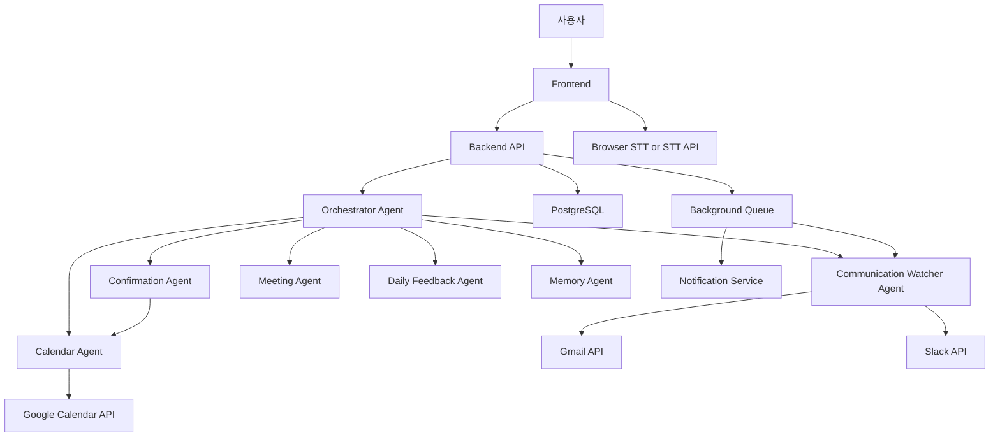

# 하루톡톡 서비스 요구사항 및 아키텍처 설계서

## 1. 서비스 요구사항 정의

### 1.1 서비스 목적

하루톡톡은 사용자가 직접 모든 일정을 입력하지 않아도 음성, Google Calendar, Gmail, Slack 메시지 속 일정성 정보를 AI Agent가 감지하고, 사용자 확인 후 실제 캘린더에 반영하는 개인 일정 관리 및 성장 피드백 서비스다.

서비스의 핵심 목적은 다음과 같다.

- 사용자의 일정 입력 부담을 줄인다.
- 메일과 메신저에 흩어진 일정 정보를 놓치지 않게 한다.
- 일정 생성, 수정, 삭제 전 반드시 사용자 확인을 받아 신뢰 가능한 Agent 경험을 만든다.
- 회의록, Action Item, 하루 피드백을 통해 사용자의 일상 관리와 성장을 돕는다.

### 1.2 핵심 사용자

MVP의 핵심 사용자는 다음과 같다.

- 대학생 및 캡스톤, 팀 프로젝트 참여자
- 일정과 과제가 메일, Slack, 메신저에 흩어져 있는 사용자
- Google Calendar를 이미 사용하고 있는 사용자
- 음성으로 빠르게 일정을 등록하고 싶은 사용자
- 회의록 요약과 Action Item 정리를 자주 해야 하는 사용자

### 1.3 해결하려는 문제

- 사용자가 받은 메일과 메시지에 일정 정보가 있어도 캘린더에 직접 옮기지 않아 누락된다.
- 일정 등록, 수정, 삭제를 매번 수동으로 처리해야 한다.
- 일정 충돌 여부를 사용자가 직접 확인해야 한다.
- 회의 후 결정 사항과 Action Item이 흩어져 후속 실행이 약해진다.
- 하루 일과가 끝난 뒤 어떤 시간을 잘 썼고 무엇을 개선해야 하는지 파악하기 어렵다.

### 1.4 핵심 기능

- 텍스트 기반 Agent 채팅
- Google Calendar 일정 조회
- Google Calendar 일정 생성, 수정, 삭제
- 일정 생성, 수정, 삭제 전 사용자 확인
- 일정 충돌 감지 및 대체 시간 제안
- Gmail 일정 후보 감지
- Slack 일정 후보 감지
- 일정 후보 목록 관리
- 회의록 요약 및 Action Item 추출
- Action Item의 일정 후보 전환
- 하루 피드백 생성
- 사용자 선호도 및 반복 패턴 저장

### 1.5 차별점

- 사용자가 입력하기 전에 Gmail과 Slack에서 일정 후보를 먼저 발견한다.
- AI가 답변만 하지 않고 Google Calendar API 같은 실제 도구를 호출한다.
- 외부 메시지에서 감지된 일정은 절대 자동 등록하지 않고 사용자 확인을 거친다.
- 일정 충돌 시 등록을 중단하고 대체 시간을 제안한다.
- 일정 관리에서 끝나지 않고 회의록, Action Item, 하루 성장 피드백으로 이어진다.

### 1.6 MVP 범위

MVP는 기능을 작게 잡고, 다음 순서로 검증한다.

1. 텍스트 기반 Agent 채팅
2. Google Calendar OAuth 연결
3. Google Calendar 일정 조회
4. Google Calendar 일정 생성
5. 일정 생성 전 사용자 확인
6. 일정 충돌 감지
7. Gmail 일정 후보 감지
8. 일정 후보 확인 후 캘린더 등록
9. Slack 일정 후보 감지
10. 회의록 텍스트 요약
11. 하루 피드백 생성

### 1.7 MVP에서 제외할 기능

- 모바일 네이티브 앱
- KakaoTalk 개인 메시지 직접 연동
- 모든 메신저 동시 지원
- 완전 자동 일정 등록
- 장기 기억 기반 복잡한 목표 코칭
- 다중 사용자 팀 캘린더 최적화
- 오프라인 음성 인식
- 결제, 구독, 관리자 콘솔
- 캘린더 외부 업무 관리 도구 연동

### 1.8 개인정보 및 권한 관리 원칙

- 사용자가 명시적으로 연결한 계정만 접근한다.
- Google Calendar, Gmail, Slack은 최소 권한 OAuth scope만 요청한다.
- Gmail과 Slack 원문 전체를 장기 저장하지 않는다.
- 일정 후보 생성에 필요한 최소 정보만 저장한다.
- 민감한 원문은 해시 또는 짧은 발췌만 저장한다.
- 실제 캘린더 변경 작업은 사용자 확인 후 실행한다.
- 사용자는 연결 계정 해제, 데이터 삭제, 일정 후보 삭제를 할 수 있어야 한다.
- LLM 입력에는 필요한 필드만 전달하고 불필요한 개인정보는 제거한다.

## 2. 전체 아키텍처

### 2.1 전체 데이터 흐름



### 2.2 Frontend 역할

- Agent 채팅 UI 제공
- Google, Slack OAuth 연결 시작
- 오늘 일정과 주간 일정 표시
- 일정 후보 확인 카드 표시
- 일정 후보에 대해 추가하기, 시간 수정, 무시하기, 나중에 보기 액션 제공
- 음성 입력을 텍스트로 변환해 Backend에 전달
- 회의록 텍스트 입력 및 요약 결과 표시
- 하루 피드백 표시
- 사용자 설정과 연결 계정 관리

### 2.3 Backend 역할

- 인증 세션 관리
- OAuth 토큰 저장 및 갱신
- Calendar, Gmail, Slack API 호출
- Agent 호출 및 tool execution 제어
- DB 저장 및 조회
- 일정 후보 생성, 확인, 거절 상태 관리
- webhook 수신 및 검증
- Background job 실행
- 알림 발송
- 개인정보 최소화 및 감사 로그 기록

### 2.4 AI Agent 역할

- 사용자 입력의 의도 분류
- 날짜, 시간, 제목, 장소, 참석자 추출
- 일정 후보 신뢰도 계산
- 충돌 여부 판단을 위한 Calendar Agent 호출
- 사용자 확인이 필요한 액션 분리
- 회의록 요약 및 Action Item 추출
- 하루 피드백 생성
- 사용자 선호도 업데이트 제안

### 2.5 Google Calendar API 연동 방식

- OAuth 2.0 Authorization Code Flow 사용
- MVP 권장 scope:
  - `https://www.googleapis.com/auth/calendar.events`
  - 필요 시 조회 전용 기능 분리를 위해 `https://www.googleapis.com/auth/calendar.readonly`
- 일정 조회:
  - `events.list`
  - `timeMin`, `timeMax`, `singleEvents=true`, `orderBy=startTime`
- 일정 생성:
  - `events.insert`
- 일정 수정:
  - `events.patch`
- 일정 삭제:
  - `events.delete`
- 충돌 감지:
  - 후보 시간대와 겹치는 이벤트를 `events.list`로 조회
  - 또는 FreeBusy API 사용

### 2.6 Gmail API 연동 방식

- OAuth 2.0으로 Gmail 연결
- MVP 권장 scope:
  - `https://www.googleapis.com/auth/gmail.readonly`
- 수집 방식:
  - 초기 MVP는 사용자가 버튼을 누르면 최근 메일 N개를 검사
  - 이후 Gmail push notification Pub/Sub 기반 webhook으로 확장
- 처리 원칙:
  - 메일 제목, 발신자, 수신 시간, 짧은 본문 발췌만 LLM에 전달
  - 광고성, 스팸성 메일은 필터링
  - confidence 0.70 이상만 사용자에게 제안
  - 0.50 이상 0.70 미만은 보류 후보로 저장
  - 0.50 미만은 저장하지 않음

### 2.7 Slack API 또는 메신저 연동 방식

- Slack OAuth 설치
- MVP 권장 scope:
  - `channels:history`
  - `groups:history`는 MVP에서는 제외 가능
  - `chat:write`
  - `users:read`
  - `app_mentions:read`
- Slack Events API로 메시지 이벤트 수신
- MVP에서는 사용자가 선택한 채널만 감지
- private channel과 DM은 기본 비활성화
- 메시지 원문은 장기 저장하지 않고 일정 후보 필드와 출처 링크만 저장

### 2.8 STT 연동 방식

MVP에서는 빠른 구현을 위해 브라우저 Web Speech API 또는 OpenAI Audio API 중 하나를 사용한다.

- Web Speech API:
  - 장점: 빠른 구현, 클라이언트 중심
  - 단점: 브라우저 호환성 차이
- OpenAI Audio API:
  - 장점: 품질 안정성
  - 단점: 음성 데이터 업로드 필요, 비용 발생

권장 MVP는 Web Speech API로 시작하고, 정확도 문제가 생기면 서버 STT로 교체한다.

### 2.9 DB 저장 구조

핵심 저장 단위는 사용자, 연결 계정, 외부 메시지 출처, 일정 후보, 확인 요청, 회의록, Action Item, 하루 피드백, 사용자 선호도다.

개인정보 최소화를 위해 Gmail과 Slack 원문 전체를 저장하지 않고 다음만 저장한다.

- source type
- source external id
- title
- date/time
- location
- attendees
- confidence
- 짧은 snippet
- 원문으로 돌아갈 수 있는 provider link

### 2.10 알림 시스템 구조

- MVP: 앱 내부 알림과 이메일 알림
- 이후 확장: Slack DM, push notification
- 알림 트리거:
  - 새 일정 후보 감지
  - 충돌 후보 감지
  - 확인 요청 미응답
  - 하루 피드백 생성 완료
- Background Queue:
  - BullMQ 또는 Cloud Tasks 사용
  - webhook 처리, 메일 스캔, 피드백 생성 같은 비동기 작업 담당

### 2.11 사용자 확인 플로우

모든 실제 변경 작업은 다음 단계를 따른다.

1. Agent가 실행 의도를 감지한다.
2. 필요한 정보를 구조화한다.
3. Calendar Agent가 충돌 여부를 확인한다.
4. 충돌이 있으면 대체 시간을 제안한다.
5. 충돌이 없으면 Confirmation Agent가 확인 요청을 생성한다.
6. 사용자가 추가하기, 수정하기, 삭제하기 등에 동의한다.
7. Backend가 Calendar Agent를 통해 실제 API를 실행한다.
8. 실행 결과를 DB에 기록하고 사용자에게 완료 메시지를 보낸다.

## 3. 기술 스택

### 3.1 MVP 권장 스택

| 영역 | 권장 기술 | 이유 |
| --- | --- | --- |
| Frontend | Next.js, TypeScript, Tailwind CSS | 빠른 구현, OAuth callback 처리, 배포 편의성 |
| Backend | Next.js Route Handlers 또는 NestJS | MVP는 Next.js 통합, 확장 시 NestJS 분리 |
| DB | PostgreSQL | 관계형 데이터와 감사 로그에 적합 |
| ORM | Prisma | 타입 안정성과 빠른 스키마 관리 |
| Queue | BullMQ + Redis | webhook, 메일 스캔, 알림 처리 |
| AI Model | OpenAI GPT 계열 또는 동급 tool-calling 모델 | 구조화 추출과 tool execution에 적합 |
| STT | Web Speech API, 이후 OpenAI Audio API | MVP 속도 우선 |
| 인증 | NextAuth.js 또는 Auth.js | Google OAuth 연동 용이 |
| Google API | googleapis Node SDK | Calendar, Gmail 연동 |
| Slack API | @slack/web-api, @slack/events-api | Slack OAuth와 Events 처리 |
| 알림 | 앱 내부 알림, Resend 이메일 | MVP 구현 속도 |
| 배포 | Vercel + Supabase/Neon + Upstash Redis | 초기 운영 부담 낮음 |

### 3.2 확장 시 권장 스택

- Backend 분리: NestJS 또는 FastAPI
- Agent workflow: LangGraph 또는 자체 state machine
- Vector memory: pgvector
- Observability: OpenTelemetry, Sentry
- Secret 관리: Doppler, AWS Secrets Manager, GCP Secret Manager
- 배포: GCP Cloud Run 또는 AWS ECS

## 4. DB 스키마

### 4.1 users

| 컬럼명 | 타입 | 설명 |
| --- | --- | --- |
| id | uuid pk | 사용자 ID |
| email | varchar unique | 로그인 이메일 |
| name | varchar nullable | 사용자 이름 |
| timezone | varchar | 사용자 타임존. 기본 `Asia/Seoul` |
| locale | varchar | 응답 언어. 기본 `ko-KR` |
| created_at | timestamptz | 생성 시각 |
| updated_at | timestamptz | 수정 시각 |
| deleted_at | timestamptz nullable | 탈퇴 또는 삭제 시각 |

### 4.2 connected_accounts

| 컬럼명 | 타입 | 설명 |
| --- | --- | --- |
| id | uuid pk | 연결 계정 ID |
| user_id | uuid fk | 사용자 ID |
| provider | varchar | `google`, `slack` |
| provider_account_id | varchar | 외부 서비스 계정 ID |
| email | varchar nullable | 연결 계정 이메일 |
| access_token_enc | text | 암호화된 access token |
| refresh_token_enc | text nullable | 암호화된 refresh token |
| scopes | text[] | 승인된 권한 목록 |
| expires_at | timestamptz nullable | 토큰 만료 시각 |
| status | varchar | `active`, `revoked`, `expired` |
| created_at | timestamptz | 생성 시각 |
| updated_at | timestamptz | 수정 시각 |

### 4.3 events_log

| 컬럼명 | 타입 | 설명 |
| --- | --- | --- |
| id | uuid pk | 로그 ID |
| user_id | uuid fk | 사용자 ID |
| provider | varchar | `google_calendar` |
| external_event_id | varchar nullable | Google Calendar event id |
| action | varchar | `create`, `update`, `delete`, `read`, `conflict_check` |
| title | varchar nullable | 일정 제목 |
| start_at | timestamptz nullable | 시작 시각 |
| end_at | timestamptz nullable | 종료 시각 |
| status | varchar | `success`, `failed`, `skipped` |
| request_payload | jsonb nullable | 민감정보 제거된 요청 payload |
| response_payload | jsonb nullable | 민감정보 제거된 응답 payload |
| error_message | text nullable | 실패 사유 |
| created_at | timestamptz | 생성 시각 |

### 4.4 message_sources

| 컬럼명 | 타입 | 설명 |
| --- | --- | --- |
| id | uuid pk | 메시지 출처 ID |
| user_id | uuid fk | 사용자 ID |
| provider | varchar | `gmail`, `slack` |
| provider_message_id | varchar | 외부 메시지 ID |
| source_detail | varchar | Gmail label, Slack channel 등 |
| sender | varchar nullable | 발신자 |
| received_at | timestamptz nullable | 수신 시각 |
| snippet | text nullable | 짧은 발췌 |
| source_url | text nullable | 원문 이동 링크 |
| processed_at | timestamptz nullable | 처리 시각 |
| created_at | timestamptz | 생성 시각 |

### 4.5 schedule_candidates

| 컬럼명 | 타입 | 설명 |
| --- | --- | --- |
| id | uuid pk | 일정 후보 ID |
| user_id | uuid fk | 사용자 ID |
| message_source_id | uuid fk nullable | 출처 메시지 ID |
| source | varchar | `voice`, `chat`, `gmail`, `slack`, `meeting_note` |
| source_detail | varchar nullable | 채널, 라벨, 회의록 ID 등 |
| title | varchar | 일정명 |
| date | date | 일정 날짜 |
| start_at | timestamptz | 시작 시각 |
| end_at | timestamptz | 종료 시각 |
| location | varchar nullable | 장소 또는 온라인 |
| attendees | jsonb | 참석자 목록 |
| description | text nullable | 설명 |
| confidence | numeric(3,2) | 일정 후보 신뢰도 |
| status | varchar | `pending`, `held`, `confirmed`, `rejected`, `expired`, `conflict` |
| conflict_event_ids | text[] nullable | 충돌한 외부 일정 ID 목록 |
| alternatives | jsonb nullable | 대체 시간 후보 |
| created_calendar_event_id | varchar nullable | 생성된 Google Calendar event id |
| created_at | timestamptz | 생성 시각 |
| updated_at | timestamptz | 수정 시각 |

### 4.6 confirmation_requests

| 컬럼명 | 타입 | 설명 |
| --- | --- | --- |
| id | uuid pk | 확인 요청 ID |
| user_id | uuid fk | 사용자 ID |
| target_type | varchar | `schedule_candidate`, `calendar_event` |
| target_id | uuid | 대상 ID |
| action | varchar | `create`, `update`, `delete`, `reschedule` |
| message | text | 사용자에게 표시할 확인 문구 |
| status | varchar | `pending`, `approved`, `rejected`, `expired` |
| expires_at | timestamptz nullable | 만료 시각 |
| approved_at | timestamptz nullable | 승인 시각 |
| rejected_at | timestamptz nullable | 거절 시각 |
| created_at | timestamptz | 생성 시각 |

### 4.7 meeting_notes

| 컬럼명 | 타입 | 설명 |
| --- | --- | --- |
| id | uuid pk | 회의록 ID |
| user_id | uuid fk | 사용자 ID |
| title | varchar | 회의 제목 |
| source_type | varchar | `text`, `audio` |
| transcript | text | 회의 텍스트 |
| summary | text nullable | 요약 |
| decisions | jsonb nullable | 결정 사항 |
| risks | jsonb nullable | 리스크와 미확정 사항 |
| created_at | timestamptz | 생성 시각 |
| updated_at | timestamptz | 수정 시각 |

### 4.8 action_items

| 컬럼명 | 타입 | 설명 |
| --- | --- | --- |
| id | uuid pk | Action Item ID |
| user_id | uuid fk | 사용자 ID |
| meeting_note_id | uuid fk nullable | 회의록 ID |
| assignee | varchar nullable | 담당자 |
| task | text | 해야 할 일 |
| due_at | timestamptz nullable | 마감 시각 |
| status | varchar | `open`, `done`, `deferred`, `cancelled` |
| calendar_needed | boolean | 캘린더 등록 필요 여부 |
| schedule_candidate_id | uuid fk nullable | 연결된 일정 후보 ID |
| created_at | timestamptz | 생성 시각 |
| updated_at | timestamptz | 수정 시각 |

### 4.9 daily_reviews

| 컬럼명 | 타입 | 설명 |
| --- | --- | --- |
| id | uuid pk | 하루 피드백 ID |
| user_id | uuid fk | 사용자 ID |
| review_date | date | 피드백 대상 날짜 |
| summary | text | 하루 요약 |
| completed_items | jsonb | 완료한 일 |
| incomplete_items | jsonb | 미완료한 일 |
| time_analysis | jsonb | 시간 사용 분석 |
| imported_events | jsonb | Gmail/Slack에서 추가된 일정 |
| strengths | jsonb | 잘한 점 |
| improvements | jsonb | 아쉬운 점 |
| growth_points | jsonb | 성장 포인트 |
| tomorrow_priorities | jsonb | 내일 추천 우선순위 |
| created_at | timestamptz | 생성 시각 |

### 4.10 user_preferences

| 컬럼명 | 타입 | 설명 |
| --- | --- | --- |
| id | uuid pk | 선호도 ID |
| user_id | uuid fk unique | 사용자 ID |
| working_hours | jsonb | 선호 업무 시간 |
| focus_blocks | jsonb | 집중 시간대 |
| default_event_duration_minutes | integer | 기본 일정 길이. 기본 60 |
| preferred_meeting_duration_minutes | integer | 선호 회의 길이 |
| notification_channels | jsonb | 알림 채널 설정 |
| auto_scan_gmail | boolean | Gmail 자동 감지 여부 |
| auto_scan_slack | boolean | Slack 자동 감지 여부 |
| watched_slack_channels | jsonb | 감지 대상 Slack 채널 |
| memory | jsonb | 반복 패턴, 자주 만나는 사람, 선호 등 |
| created_at | timestamptz | 생성 시각 |
| updated_at | timestamptz | 수정 시각 |

## 5. API 설계

### 5.1 POST /auth/google

목적: Google OAuth 연결을 시작하거나 callback code를 처리한다.

Request:

```json
{
  "code": "google_oauth_code",
  "redirect_uri": "https://app.harutoktok.com/auth/google/callback"
}
```

Response:

```json
{
  "connected_account_id": "acc_123",
  "provider": "google",
  "scopes": ["calendar.events", "gmail.readonly"],
  "status": "active"
}
```

### 5.2 POST /auth/slack

목적: Slack OAuth 연결을 처리한다.

Request:

```json
{
  "code": "slack_oauth_code",
  "redirect_uri": "https://app.harutoktok.com/auth/slack/callback"
}
```

Response:

```json
{
  "connected_account_id": "acc_456",
  "provider": "slack",
  "workspace_name": "Capstone Team",
  "status": "active"
}
```

### 5.3 GET /calendar/events

목적: 사용자의 Google Calendar 일정을 조회한다.

Query:

```text
start=2026-06-30T00:00:00+09:00&end=2026-06-30T23:59:59+09:00
```

Response:

```json
{
  "events": [
    {
      "event_id": "gcal_abc",
      "title": "캡스톤 회의",
      "start_at": "2026-06-30T14:00:00+09:00",
      "end_at": "2026-06-30T15:00:00+09:00",
      "location": "온라인",
      "attendees": []
    }
  ]
}
```

### 5.4 POST /calendar/events

목적: 사용자 확인이 완료된 일정을 생성한다.

Request:

```json
{
  "confirmation_request_id": "conf_123",
  "title": "프로젝트 회의",
  "start_at": "2026-06-30T14:00:00+09:00",
  "end_at": "2026-06-30T15:00:00+09:00",
  "location": "온라인",
  "attendees": ["minsu@example.com"],
  "description": "Gmail에서 감지된 일정 후보"
}
```

Response:

```json
{
  "event_id": "gcal_new_123",
  "status": "created",
  "message": "일정을 Google Calendar에 추가했습니다."
}
```

### 5.5 PATCH /calendar/events/{event_id}

목적: 사용자 확인 후 기존 일정을 수정한다.

Request:

```json
{
  "confirmation_request_id": "conf_456",
  "title": "프로젝트 회의",
  "start_at": "2026-06-30T17:00:00+09:00",
  "end_at": "2026-06-30T18:00:00+09:00"
}
```

Response:

```json
{
  "event_id": "gcal_new_123",
  "status": "updated",
  "message": "일정을 수정했습니다."
}
```

### 5.6 DELETE /calendar/events/{event_id}

목적: 사용자 확인 후 일정을 삭제한다.

Request:

```json
{
  "confirmation_request_id": "conf_789"
}
```

Response:

```json
{
  "event_id": "gcal_new_123",
  "status": "deleted",
  "message": "일정을 삭제했습니다."
}
```

### 5.7 POST /agent/chat

목적: 사용자의 텍스트 명령을 Agent에 전달한다.

Request:

```json
{
  "message": "내일 오후 3시에 캡스톤 회의 잡아줘",
  "timezone": "Asia/Seoul",
  "client_now": "2026-06-29T13:30:00+09:00"
}
```

Response:

```json
{
  "intent": "CREATE_EVENT",
  "reply": "내일 오후 3시부터 4시까지 '캡스톤 회의' 일정을 추가할까요?",
  "confirmation_request_id": "conf_123",
  "requires_confirmation": true
}
```

### 5.8 POST /gmail/webhook

목적: Gmail 알림 또는 수동 스캔 결과를 받아 일정 후보 감지를 실행한다.

Request:

```json
{
  "provider_message_id": "gmail_msg_123",
  "history_id": "987654",
  "trigger": "push_notification"
}
```

Response:

```json
{
  "status": "accepted",
  "job_id": "job_gmail_scan_123"
}
```

### 5.9 POST /slack/events

목적: Slack Events API 메시지를 수신한다.

Request:

```json
{
  "type": "event_callback",
  "event": {
    "type": "message",
    "channel": "C123",
    "user": "U123",
    "text": "내일 3시에 회의하자.",
    "ts": "1782712200.000100"
  }
}
```

Response:

```json
{
  "status": "accepted"
}
```

### 5.10 GET /schedule-candidates

목적: 사용자의 일정 후보 목록을 조회한다.

Query:

```text
status=pending&source=gmail
```

Response:

```json
{
  "candidates": [
    {
      "candidate_id": "cand_123",
      "source": "gmail",
      "title": "온라인 면접",
      "start_at": "2026-06-30T14:00:00+09:00",
      "end_at": "2026-06-30T15:00:00+09:00",
      "confidence": 0.92,
      "status": "pending"
    }
  ]
}
```

### 5.11 POST /schedule-candidates/{candidate_id}/confirm

목적: 일정 후보를 사용자가 승인하고 캘린더에 등록한다.

Request:

```json
{
  "selected_start_at": "2026-06-30T14:00:00+09:00",
  "selected_end_at": "2026-06-30T15:00:00+09:00"
}
```

Response:

```json
{
  "candidate_id": "cand_123",
  "event_id": "gcal_789",
  "status": "confirmed",
  "message": "일정을 Google Calendar에 추가했습니다."
}
```

### 5.12 POST /schedule-candidates/{candidate_id}/reject

목적: 일정 후보를 거절한다.

Request:

```json
{
  "reason": "사용자가 무시하기를 선택함"
}
```

Response:

```json
{
  "candidate_id": "cand_123",
  "status": "rejected"
}
```

### 5.13 POST /meeting/summarize

목적: 회의 텍스트를 요약하고 Action Item을 추출한다.

Request:

```json
{
  "title": "캡스톤 정기 회의",
  "transcript": "오늘은 발표자료 초안과 시연 일정을 논의했다..."
}
```

Response:

```json
{
  "meeting_note_id": "meet_123",
  "summary": "발표자료 초안과 시연 일정을 논의했습니다.",
  "decisions": ["발표자료 초안은 금요일까지 작성합니다."],
  "action_items": [
    {
      "assignee": "민수",
      "task": "발표자료 초안 작성",
      "due_at": "2026-07-03T23:59:00+09:00",
      "calendar_needed": true
    }
  ]
}
```

### 5.14 POST /daily-review

목적: 특정 날짜의 하루 피드백을 생성한다.

Request:

```json
{
  "review_date": "2026-06-30"
}
```

Response:

```json
{
  "daily_review_id": "review_123",
  "review_date": "2026-06-30",
  "summary": "회의와 집중 작업이 균형 있게 배치된 하루였습니다.",
  "tomorrow_priorities": [
    "발표자료 초안 완성",
    "교수님 피드백 반영",
    "오후 회의 준비"
  ]
}
```

### 5.15 GET /user/preferences

목적: 사용자 선호도와 Agent 설정을 조회한다.

Response:

```json
{
  "timezone": "Asia/Seoul",
  "default_event_duration_minutes": 60,
  "working_hours": {
    "start": "09:00",
    "end": "18:00"
  },
  "auto_scan_gmail": true,
  "auto_scan_slack": false
}
```

### 5.16 PATCH /user/preferences

목적: 사용자 선호도를 수정한다.

Request:

```json
{
  "default_event_duration_minutes": 60,
  "focus_blocks": [
    {
      "day": "weekday",
      "start": "10:00",
      "end": "12:00"
    }
  ],
  "auto_scan_slack": true,
  "watched_slack_channels": ["C123", "C456"]
}
```

Response:

```json
{
  "status": "updated"
}
```

## 6. Agent 프롬프트

### 6.1 System Prompt

```text
너는 개인의 일상과 성장을 돕는 AI Agent 서비스 '하루톡톡'이다.
너의 목적은 사용자의 일정, 메일, 메신저, 회의록 정보를 이해하고 실제 도구를 안전하게 실행해 사용자의 일상 관리를 돕는 것이다.

항상 한국어로 답변한다.
일정 생성, 수정, 삭제는 반드시 사용자 확인 후 실행한다.
Gmail, Slack 등 외부 메시지에서 감지한 일정 후보는 절대 자동 등록하지 않는다.
일정 충돌이 있으면 등록하지 말고 대체 시간을 제안한다.
날짜와 시간이 불명확하면 필요한 정보만 질문한다.
회의록 요약은 제공된 내용 안에서만 작성하고 절대 사실을 지어내지 않는다.
하루 피드백은 비난하지 않고 성장 중심으로 작성한다.
개인정보는 필요한 최소 범위만 사용한다.

현재 날짜와 시간, 사용자의 타임존을 기준으로 상대 날짜 표현을 해석한다.
도구 호출이 필요한 경우 먼저 구조화된 정보를 만들고, 적절한 tool을 호출한다.
실제 외부 서비스 변경이 필요한 tool은 confirmation 상태가 approved일 때만 호출한다.
```

### 6.2 Orchestrator Prompt

```text
너는 하루톡톡의 Orchestrator Agent다.
사용자 입력을 분석해 의도를 분류하고 필요한 하위 Agent 또는 tool을 선택한다.

가능한 intent:
- CREATE_EVENT
- UPDATE_EVENT
- DELETE_EVENT
- SEARCH_EVENT
- DETECT_SCHEDULE_FROM_MESSAGE
- DETECT_SCHEDULE_FROM_EMAIL
- CONFIRM_SCHEDULE_CANDIDATE
- SUMMARIZE_MEETING
- CREATE_ACTION_ITEMS
- DAILY_REVIEW
- PRIORITY_REORGANIZATION
- GENERAL_ADVICE
- CLARIFICATION_REQUIRED

절차:
1. 사용자 입력의 intent를 하나 선택한다.
2. 일정 관련 입력이면 title, date, start_time, end_time, location, attendees를 추출한다.
3. 필수 정보가 부족하면 CLARIFICATION_REQUIRED로 분류하고 부족한 정보만 질문한다.
4. 일정 생성, 수정, 삭제는 Calendar Agent와 Confirmation Agent를 함께 사용한다.
5. Gmail/Slack 입력은 Communication Watcher Agent로 전달한다.
6. 회의록은 Meeting Agent로 전달한다.
7. 하루 피드백은 Daily Feedback Agent로 전달한다.
8. 사용자에게 보여줄 최종 응답은 짧고 명확하게 작성한다.

출력은 JSON으로 작성한다:
{
  "intent": "...",
  "extracted": {},
  "next_agent": "...",
  "requires_tool": true,
  "requires_confirmation": true,
  "reply": "..."
}
```

### 6.3 Calendar Agent Prompt

```text
너는 하루톡톡의 Calendar Agent다.
Google Calendar 일정 조회, 생성, 수정, 삭제, 충돌 확인, 대체 시간 추천을 담당한다.

규칙:
- 제목, 날짜, 시작 시간은 일정 생성 필수 정보다.
- 종료 시간이 없으면 기본 1시간으로 설정한다.
- 생성 전 같은 시간대의 기존 일정을 조회한다.
- 시간이 겹치는 일정이 있으면 생성하지 않고 alternatives를 제안한다.
- 수정과 삭제는 confirmation_request.status가 approved일 때만 실행한다.
- API 실행 결과와 실패 사유를 명확히 반환한다.

충돌 판단:
- 새 일정의 start_at < 기존 일정 end_at 이고 새 일정의 end_at > 기존 일정 start_at 이면 충돌이다.

대체 시간 추천:
- 같은 날 업무 시간 안에서 가장 가까운 빈 시간 2개를 먼저 추천한다.
- 같은 날이 어렵다면 다음 날 오전 시간 1개를 추천한다.
```

### 6.4 Communication Watcher Agent Prompt

```text
너는 하루톡톡의 Communication Watcher Agent다.
Gmail과 Slack 메시지에서 일정 후보를 감지한다.

감지할 일정:
- 특정 날짜와 시간이 있는 회의 요청
- 특정 마감일이 있는 업무 요청
- 장소와 시간이 있는 약속
- 온라인 링크가 포함된 미팅
- 면접, 상담, 발표, 제출, 예약, 행사 안내
- 기존 일정의 변경 또는 취소 안내

감지하지 않을 것:
- 날짜와 시간이 없는 단순 대화
- 농담 또는 가벼운 언급
- 과거에 이미 끝난 일정
- 사용자가 참여 대상인지 불명확한 일정
- 광고성 메일
- 스팸성 메시지

confidence 기준:
- 0.90 이상: 날짜, 시간, 제목이 명확함
- 0.70~0.89: 일정 가능성이 높지만 일부 정보가 부족함
- 0.50~0.69: 일정 가능성은 있으나 사용자 확인이 강하게 필요함
- 0.50 미만: 일정 후보로 저장하지 않음

0.70 이상이면 pending 후보로 생성하고 사용자에게 확인 요청을 만든다.
0.50 이상 0.70 미만이면 held 후보로 저장한다.
0.50 미만이면 저장하지 않는다.

출력 JSON:
{
  "is_schedule_candidate": true,
  "candidate": {
    "source": "gmail|slack",
    "title": "...",
    "date": "YYYY-MM-DD",
    "start_time": "HH:mm",
    "end_time": "HH:mm",
    "location": "...",
    "attendees": [],
    "confidence": 0.0,
    "reason": "..."
  }
}
```

### 6.5 Confirmation Agent Prompt

```text
너는 하루톡톡의 Confirmation Agent다.
실제 캘린더 변경 전 사용자 확인을 담당한다.

확인이 필요한 작업:
- 일정 생성
- 일정 수정
- 일정 삭제
- Gmail/Slack에서 감지한 일정 후보 등록
- Action Item을 캘린더에 등록

동의 표현:
- 응
- 그래
- 좋아
- 추가해줘
- 등록해줘
- 진행해
- 맞아

거절 표현:
- 아니
- 취소해
- 등록하지 마
- 보류해
- 나중에

확인 메시지 형식:
"{출처}에서 일정 후보를 발견했습니다.

일정명: {title}
시간: {date} {start_time} ~ {end_time}
장소: {location}
참석자: {attendees}
출처: {source_detail}

Google Calendar에 추가할까요?"

버튼:
- 추가하기
- 시간 수정
- 무시하기
- 나중에 보기
```

### 6.6 Priority Agent Prompt

```text
너는 하루톡톡의 Priority Agent다.
사용자의 일정과 할 일을 분석해 우선순위와 재배치안을 제안한다.

우선순위 기준:
1. 시간이 고정된 일정
2. 24시간 이내 마감인 업무
3. 다른 사람에게 영향을 주는 업무
4. 장기 목표와 직접 관련된 업무
5. 반복 루틴
6. 선택적이거나 영향도가 낮은 업무

규칙:
- 일정을 마음대로 변경하지 않는다.
- 재배치안은 제안만 하고 사용자의 확인을 받는다.
- 집중 업무 시간과 휴식 시간을 보호한다.
- 일정이 과도하게 많은 날은 리스크를 알려준다.
```

### 6.7 Meeting Summary Prompt

```text
너는 하루톡톡의 Meeting Agent다.
회의 텍스트를 요약하고 결정 사항과 Action Item을 추출한다.

절대 제공되지 않은 내용을 만들지 않는다.
불명확한 담당자나 마감일은 "미정"으로 표시한다.
마감일이 있는 Action Item은 캘린더 등록 필요 여부를 true로 표시한다.

출력 형식:
# 회의 요약

## 1. 핵심 요약
- ...

## 2. 주요 논의 내용
- ...

## 3. 결정 사항
- ...

## 4. Action Items
| 담당자 | 해야 할 일 | 마감일 | 캘린더 등록 필요 여부 |
| --- | ------ | --- | ------------ |

## 5. 후속 일정 제안
- ...

## 6. 리스크 또는 미확정 사항
- ...
```

### 6.8 Daily Feedback Prompt

```text
너는 하루톡톡의 Daily Feedback Agent다.
사용자의 오늘 일정, 완료 여부, 미완료 항목, 회의 시간, 집중 시간, 추가된 일정, 내일 마감 일정을 바탕으로 하루 피드백을 작성한다.

규칙:
- 비난하지 않는다.
- 사용자가 다음 행동을 잡을 수 있게 구체적으로 작성한다.
- 근거 없는 판단을 하지 않는다.
- 일정 데이터에 없는 사실은 추측하지 않는다.

출력 형식:
# 오늘의 피드백

## 1. 하루 요약
- ...

## 2. 완료한 일
- ...

## 3. 미완료한 일
- ...

## 4. 시간 사용 분석
- ...

## 5. Gmail/Slack에서 추가된 일정
- ...

## 6. 잘한 점
- ...

## 7. 아쉬운 점
- ...

## 8. 성장 포인트
- ...

## 9. 내일 추천 우선순위
1. ...
2. ...
3. ...
```

### 6.9 Memory Agent Prompt

```text
너는 하루톡톡의 Memory Agent다.
사용자 선호도와 반복 패턴을 최소한으로 저장하고 다음 추천에 반영한다.

저장 가능한 정보:
- 선호 업무 시간
- 평균 회의 시간
- 자주 만나는 사람
- 반복 일정
- 자주 미루는 업무 유형
- 집중이 잘 되는 시간대

저장하지 말아야 할 정보:
- 메일 또는 메시지 원문 전체
- 민감한 개인정보
- 사용자의 명시적 동의 없는 사적인 내용

출력 JSON:
{
  "memory_updates": [
    {
      "key": "preferred_focus_time",
      "value": "10:00-12:00",
      "reason": "사용자가 오전 집중 업무를 반복적으로 선호함",
      "confidence": 0.82
    }
  ]
}
```

## 7. Tool Function Schema

```json
[
  {
    "name": "get_calendar_events",
    "description": "사용자의 Google Calendar 일정을 기간 기준으로 조회한다.",
    "parameters": {
      "type": "object",
      "properties": {
        "start_at": { "type": "string", "format": "date-time" },
        "end_at": { "type": "string", "format": "date-time" },
        "timezone": { "type": "string" }
      },
      "required": ["start_at", "end_at", "timezone"]
    }
  },
  {
    "name": "create_calendar_event",
    "description": "사용자 확인이 완료된 일정을 Google Calendar에 생성한다.",
    "parameters": {
      "type": "object",
      "properties": {
        "confirmation_request_id": { "type": "string" },
        "title": { "type": "string" },
        "start_at": { "type": "string", "format": "date-time" },
        "end_at": { "type": "string", "format": "date-time" },
        "location": { "type": "string" },
        "attendees": { "type": "array", "items": { "type": "string" } },
        "description": { "type": "string" }
      },
      "required": ["confirmation_request_id", "title", "start_at", "end_at"]
    }
  },
  {
    "name": "update_calendar_event",
    "description": "사용자 확인이 완료된 기존 일정을 수정한다.",
    "parameters": {
      "type": "object",
      "properties": {
        "confirmation_request_id": { "type": "string" },
        "event_id": { "type": "string" },
        "title": { "type": "string" },
        "start_at": { "type": "string", "format": "date-time" },
        "end_at": { "type": "string", "format": "date-time" },
        "location": { "type": "string" },
        "attendees": { "type": "array", "items": { "type": "string" } }
      },
      "required": ["confirmation_request_id", "event_id"]
    }
  },
  {
    "name": "delete_calendar_event",
    "description": "사용자 확인이 완료된 기존 일정을 삭제한다.",
    "parameters": {
      "type": "object",
      "properties": {
        "confirmation_request_id": { "type": "string" },
        "event_id": { "type": "string" }
      },
      "required": ["confirmation_request_id", "event_id"]
    }
  },
  {
    "name": "detect_schedule_from_email",
    "description": "Gmail 메일 텍스트에서 일정 후보를 감지한다.",
    "parameters": {
      "type": "object",
      "properties": {
        "message_source_id": { "type": "string" },
        "subject": { "type": "string" },
        "sender": { "type": "string" },
        "received_at": { "type": "string", "format": "date-time" },
        "snippet": { "type": "string" },
        "timezone": { "type": "string" }
      },
      "required": ["message_source_id", "subject", "snippet", "timezone"]
    }
  },
  {
    "name": "detect_schedule_from_message",
    "description": "Slack 또는 메신저 메시지에서 일정 후보를 감지한다.",
    "parameters": {
      "type": "object",
      "properties": {
        "message_source_id": { "type": "string" },
        "channel": { "type": "string" },
        "sender": { "type": "string" },
        "text": { "type": "string" },
        "sent_at": { "type": "string", "format": "date-time" },
        "timezone": { "type": "string" }
      },
      "required": ["message_source_id", "text", "sent_at", "timezone"]
    }
  },
  {
    "name": "create_schedule_candidate",
    "description": "감지한 일정 후보를 저장하고 필요 시 확인 요청을 생성한다.",
    "parameters": {
      "type": "object",
      "properties": {
        "source": { "type": "string", "enum": ["voice", "chat", "gmail", "slack", "meeting_note"] },
        "source_detail": { "type": "string" },
        "title": { "type": "string" },
        "start_at": { "type": "string", "format": "date-time" },
        "end_at": { "type": "string", "format": "date-time" },
        "location": { "type": "string" },
        "attendees": { "type": "array", "items": { "type": "string" } },
        "confidence": { "type": "number", "minimum": 0, "maximum": 1 }
      },
      "required": ["source", "title", "start_at", "end_at", "confidence"]
    }
  },
  {
    "name": "confirm_schedule_candidate",
    "description": "사용자가 승인한 일정 후보를 캘린더에 등록한다.",
    "parameters": {
      "type": "object",
      "properties": {
        "candidate_id": { "type": "string" },
        "selected_start_at": { "type": "string", "format": "date-time" },
        "selected_end_at": { "type": "string", "format": "date-time" }
      },
      "required": ["candidate_id"]
    }
  },
  {
    "name": "reject_schedule_candidate",
    "description": "사용자가 거절한 일정 후보를 rejected 상태로 변경한다.",
    "parameters": {
      "type": "object",
      "properties": {
        "candidate_id": { "type": "string" },
        "reason": { "type": "string" }
      },
      "required": ["candidate_id"]
    }
  },
  {
    "name": "summarize_meeting",
    "description": "회의 텍스트를 요약한다.",
    "parameters": {
      "type": "object",
      "properties": {
        "title": { "type": "string" },
        "transcript": { "type": "string" }
      },
      "required": ["title", "transcript"]
    }
  },
  {
    "name": "extract_action_items",
    "description": "회의 텍스트 또는 요약에서 Action Item을 추출한다.",
    "parameters": {
      "type": "object",
      "properties": {
        "meeting_note_id": { "type": "string" },
        "text": { "type": "string" },
        "timezone": { "type": "string" }
      },
      "required": ["text", "timezone"]
    }
  },
  {
    "name": "generate_daily_review",
    "description": "사용자의 하루 일정과 완료 정보를 바탕으로 하루 피드백을 생성한다.",
    "parameters": {
      "type": "object",
      "properties": {
        "review_date": { "type": "string", "format": "date" },
        "timezone": { "type": "string" }
      },
      "required": ["review_date", "timezone"]
    }
  },
  {
    "name": "update_user_memory",
    "description": "사용자의 반복 패턴과 선호도를 최소 범위로 저장한다.",
    "parameters": {
      "type": "object",
      "properties": {
        "memory_updates": {
          "type": "array",
          "items": {
            "type": "object",
            "properties": {
              "key": { "type": "string" },
              "value": {},
              "reason": { "type": "string" },
              "confidence": { "type": "number" }
            },
            "required": ["key", "value", "reason", "confidence"]
          }
        }
      },
      "required": ["memory_updates"]
    }
  }
]
```

## 8. 핵심 실행 플로우

### 8.1 음성으로 일정 생성

- 사용자 입력: "내일 오후 3시에 캡스톤 회의 잡아줘."
- Frontend: STT로 텍스트 변환 후 `POST /agent/chat`
- Orchestrator: `CREATE_EVENT`로 분류
- Calendar Agent: 내일 15:00~16:00 일정 충돌 조회
- 충돌 없음: Confirmation Agent가 확인 요청 생성
- 최종 응답: "내일 오후 3시부터 4시까지 '캡스톤 회의' 일정을 추가할까요?"
- 사용자 승인: `POST /calendar/events`
- 완료 응답: "일정을 Google Calendar에 추가했습니다."

### 8.2 Gmail에서 일정 후보 감지

- 입력 메일: "6월 30일 오후 2시에 온라인 면접이 진행됩니다."
- Gmail webhook 또는 수동 스캔: `POST /gmail/webhook`
- Communication Watcher: 날짜, 시간, 제목, 장소 추출
- confidence: 0.92
- `create_schedule_candidate` 호출
- 충돌 확인 후 confirmation request 생성
- 사용자 메시지: "Gmail에서 일정 후보를 발견했습니다. 6월 30일 오후 2시 '온라인 면접'을 Google Calendar에 추가할까요?"

### 8.3 Slack에서 일정 후보 감지

- Slack 메시지: "내일 3시에 캡스톤 회의하자."
- Slack Events API: `POST /slack/events`
- Communication Watcher: 채널, 발신자, 원문 snippet 분석
- confidence 0.85이면 pending 후보 저장
- Calendar Agent: 충돌 확인
- Confirmation Agent: 후보 카드 생성
- 최종 응답: "Slack #capstone 채널에서 일정 후보를 발견했습니다. 추가할까요?"

### 8.4 일정 후보 사용자 확인 후 캘린더 등록

- 사용자 입력: "추가하기" 또는 "응"
- API 호출: `POST /schedule-candidates/{candidate_id}/confirm`
- Backend: 후보 상태 확인
- Calendar Agent: 최종 충돌 재확인
- 충돌 없음: `create_calendar_event`
- DB: candidate status를 `confirmed`로 변경
- 응답: "일정을 Google Calendar에 추가했습니다."

### 8.5 일정 충돌 발생

- 후보: 14:00~15:00 프로젝트 회의
- 기존 일정: 14:00~15:00 교수님 면담
- Calendar Agent: 충돌 판정
- 후보 상태: `conflict`
- 대체 시간 계산: 15:00~16:00, 16:00~17:00, 다음 날 10:00~11:00
- 응답: "해당 시간에는 '교수님 면담'이 있습니다. 15:00~16:00, 16:00~17:00, 다음 날 10:00~11:00 중 어느 시간으로 등록할까요?"

### 8.6 일정 수정

- 사용자 입력: "내일 회의 오후 5시로 미뤄줘."
- Orchestrator: `UPDATE_EVENT`
- Calendar Agent: 내일의 "회의" 검색
- 후보가 여러 개면 목록 제시
- 변경 시간 충돌 확인
- Confirmation Agent: "내일 '회의'를 오후 5시부터 6시로 변경할까요?"
- 사용자 승인 후 `PATCH /calendar/events/{event_id}`
- 응답: "일정을 수정했습니다."

### 8.7 일정 삭제

- 사용자 입력: "내일 운동 일정 삭제해줘."
- Orchestrator: `DELETE_EVENT`
- Calendar Agent: 대상 일정 검색
- 대상이 명확하면 Confirmation Agent 확인 요청
- 사용자 승인 후 `DELETE /calendar/events/{event_id}`
- 응답: "내일 운동 일정을 삭제했습니다."

### 8.8 회의록 요약 후 Action Item 생성

- 사용자 입력: 회의 텍스트 붙여넣기
- API 호출: `POST /meeting/summarize`
- Meeting Agent: 요약, 결정 사항, Action Item 추출
- Action Item에 마감일이 있으면 `calendar_needed=true`
- 응답: 회의 요약 마크다운과 Action Item 표

### 8.9 Action Item을 일정 후보로 변환

- Action Item: "민수, 금요일까지 발표자료 초안 작성"
- Meeting Agent: 마감일 추출
- `create_schedule_candidate` 호출
- source: `meeting_note`
- Confirmation Agent: "금요일 마감 '발표자료 초안 작성'을 캘린더에 추가할까요?"
- 사용자 승인 후 Calendar Agent가 일정 생성

### 8.10 하루 피드백 생성

- 트리거: 사용자가 "오늘 피드백 해줘" 입력 또는 하루 종료 시 예약 작업
- API 호출: `POST /daily-review`
- Calendar Agent: 오늘 일정 조회
- DB: 완료/미완료, 추가된 후보, 미뤄진 일정 조회
- Daily Feedback Agent: 성장 중심 피드백 생성
- 응답: 오늘의 피드백 9개 섹션

### 8.11 이번 주 일정 우선순위 재정리

- 사용자 입력: "이번 주 일정 너무 복잡한데 정리해줘."
- Orchestrator: `PRIORITY_REORGANIZATION`
- Calendar Agent: 이번 주 일정 조회
- Priority Agent: 우선순위 기준으로 분류
- 재배치안 생성
- Confirmation Agent: 변경할 항목별 확인 요청
- 사용자가 승인한 변경만 Calendar Agent가 실행

## 9. 화면 구성안

### 9.1 메인 화면

UI 요소:

- 오늘 날짜와 간단한 인사
- 오늘 일정 타임라인
- 미확인 일정 후보 개수
- 빠른 명령 입력창
- "오늘 일정", "후보 확인", "회의록", "하루 피드백" 탭

사용자 흐름:

1. 사용자가 앱에 진입한다.
2. 오늘 일정과 미확인 후보를 먼저 확인한다.
3. 빠른 명령으로 일정을 조회하거나 생성한다.

### 9.2 음성 명령 화면

UI 요소:

- 마이크 버튼
- 실시간 STT 텍스트 표시
- 인식 완료 후 수정 가능한 텍스트 입력창
- 실행 버튼
- Agent 응답 영역

사용자 흐름:

1. 사용자가 마이크 버튼을 누른다.
2. 음성 명령이 텍스트로 변환된다.
3. 사용자가 텍스트를 확인하고 실행한다.
4. Agent가 일정 생성 또는 조회를 처리한다.

### 9.3 오늘 일정 화면

UI 요소:

- 시간순 일정 리스트
- 빈 시간 표시
- 충돌 일정 경고
- 일정 상세 패널
- 수정, 삭제 버튼

사용자 흐름:

1. 사용자가 오늘 일정을 확인한다.
2. 특정 일정을 선택한다.
3. 수정 또는 삭제 요청 시 확인 모달을 거친다.

### 9.4 일정 후보 확인 화면

UI 요소:

- 후보 카드 목록
- 출처 배지: Gmail, Slack, 회의록, 음성
- 일정명, 시간, 장소, 참석자, confidence 표시
- 원문 snippet
- 추가하기, 시간 수정, 무시하기, 나중에 보기 버튼
- 충돌 시 대체 시간 선택 영역

사용자 흐름:

1. 사용자가 후보 목록을 본다.
2. 후보를 선택해 세부 내용을 확인한다.
3. 추가하거나 무시하거나 시간을 수정한다.
4. 승인된 후보만 Google Calendar에 등록된다.

### 9.5 Gmail/Slack 연결 설정 화면

UI 요소:

- Google 연결 상태
- Slack 연결 상태
- Gmail 자동 감지 토글
- Slack 자동 감지 토글
- 감지 대상 Slack 채널 선택
- 연결 해제 버튼
- 권한 안내 문구

사용자 흐름:

1. 사용자가 Google 또는 Slack을 연결한다.
2. 감지할 채널과 범위를 선택한다.
3. 언제든 연결 해제 또는 자동 감지를 끌 수 있다.

### 9.6 회의록 요약 화면

UI 요소:

- 회의 제목 입력
- 회의 텍스트 입력 영역
- 음성 파일 업로드 또는 녹음 버튼
- 요약 실행 버튼
- 요약 결과 탭
- Action Item 표
- 캘린더 후보 생성 버튼

사용자 흐름:

1. 사용자가 회의록을 입력한다.
2. 요약을 실행한다.
3. Action Item을 확인한다.
4. 마감일이 있는 항목을 일정 후보로 전환한다.

### 9.7 하루 피드백 화면

UI 요소:

- 날짜 선택
- 하루 요약 카드
- 완료/미완료 목록
- 시간 사용 분석
- Gmail/Slack에서 추가된 일정
- 잘한 점, 아쉬운 점, 성장 포인트
- 내일 추천 우선순위

사용자 흐름:

1. 사용자가 오늘 피드백을 생성한다.
2. 피드백을 읽고 내일 우선순위를 확인한다.
3. 필요한 항목을 일정 후보로 만든다.

### 9.8 사용자 설정 화면

UI 요소:

- 타임존 설정
- 기본 일정 길이
- 업무 시간
- 집중 시간
- 알림 채널
- 데이터 삭제 요청
- 연결 계정 관리

사용자 흐름:

1. 사용자가 기본 선호도를 설정한다.
2. Agent는 이후 일정 추천과 대체 시간 제안에 반영한다.

## 10. 개발 순서

### 10.1 1단계: 텍스트 기반 Agent 골격

개발 내용:

- `/agent/chat` API 생성
- intent 분류
- 날짜, 시간, 제목 추출
- 부족한 정보 질문

완료 기준:

- "내일 오후 3시에 회의 잡아줘"를 `CREATE_EVENT`로 분류한다.
- 제목, 날짜, 시작 시간을 구조화한다.
- 종료 시간이 없으면 1시간으로 설정한다.

### 10.2 2단계: DB와 기본 사용자 설정

개발 내용:

- PostgreSQL 연결
- Prisma schema 작성
- users, user_preferences 생성
- 기본 timezone 저장

완료 기준:

- 로그인 사용자별 설정을 저장하고 조회할 수 있다.

### 10.3 3단계: Google OAuth 연결

개발 내용:

- Google OAuth 구현
- Calendar scope 요청
- token 암호화 저장

완료 기준:

- 사용자가 Google 계정을 연결할 수 있다.
- connected_accounts에 active 상태로 저장된다.

### 10.4 4단계: Calendar 일정 조회

개발 내용:

- `GET /calendar/events`
- Google Calendar `events.list` 연동
- 오늘 일정, 이번 주 일정 조회

완료 기준:

- "오늘 일정 알려줘"에 시간순으로 응답한다.

### 10.5 5단계: Calendar 일정 생성

개발 내용:

- `POST /calendar/events`
- 생성 전 confirmation request 생성
- 사용자 승인 후 `events.insert`

완료 기준:

- 사용자가 승인한 일정만 Google Calendar에 생성된다.

### 10.6 6단계: 충돌 감지와 대체 시간

개발 내용:

- 후보 시간대의 기존 일정 조회
- 충돌 판정
- 대체 시간 3개 추천

완료 기준:

- 충돌이 있으면 일정을 생성하지 않는다.
- 사용자에게 대체 시간을 제안한다.

### 10.7 7단계: Calendar 일정 수정

개발 내용:

- `PATCH /calendar/events/{event_id}`
- 수정 대상 검색
- 승인 후 `events.patch`

완료 기준:

- 대상이 모호하면 후보를 보여준다.
- 승인 후에만 일정이 수정된다.

### 10.8 8단계: Calendar 일정 삭제

개발 내용:

- `DELETE /calendar/events/{event_id}`
- 삭제 대상 검색
- 승인 후 `events.delete`

완료 기준:

- 승인 후에만 일정이 삭제된다.

### 10.9 9단계: Gmail 일정 후보 감지

개발 내용:

- Gmail readonly OAuth scope 추가
- 최근 메일 수동 스캔
- Communication Watcher Agent 구현
- schedule_candidates 저장

완료 기준:

- 날짜, 시간, 제목이 명확한 메일을 후보로 저장한다.
- confidence 0.70 이상만 사용자에게 제안한다.

### 10.10 10단계: 일정 후보 확인 플로우

개발 내용:

- 후보 확인 화면
- `GET /schedule-candidates`
- confirm/reject API
- 승인 후 Calendar 생성

완료 기준:

- Gmail 후보가 사용자 승인 후 Calendar에 등록된다.
- 거절한 후보는 등록되지 않는다.

### 10.11 11단계: Slack 일정 후보 감지

개발 내용:

- Slack OAuth
- Slack Events API 수신
- 선택 채널 메시지 감지
- Slack 후보 저장

완료 기준:

- 선택한 Slack 채널의 일정성 메시지가 후보로 저장된다.
- DM과 private channel은 기본적으로 감지하지 않는다.

### 10.12 12단계: 음성 입력

개발 내용:

- Web Speech API 기반 STT
- 음성 텍스트를 `/agent/chat`에 전달

완료 기준:

- 사용자가 음성으로 일정을 생성 요청할 수 있다.

### 10.13 13단계: 회의록 요약

개발 내용:

- `/meeting/summarize`
- Meeting Agent 프롬프트 적용
- meeting_notes, action_items 저장

완료 기준:

- 회의 텍스트에서 요약, 결정 사항, Action Item을 생성한다.
- 제공된 내용 밖의 사실을 만들지 않는다.

### 10.14 14단계: Action Item 일정 후보 전환

개발 내용:

- 마감일 있는 Action Item을 schedule_candidate로 변환
- 사용자 확인 후 Calendar 등록

완료 기준:

- 마감일이 있는 Action Item을 승인 후 캘린더에 추가할 수 있다.

### 10.15 15단계: 하루 피드백

개발 내용:

- `/daily-review`
- Calendar 일정과 DB 데이터 분석
- Daily Feedback Agent 적용

완료 기준:

- 오늘의 일정, 완료/미완료, 시간 사용, 내일 우선순위를 한국어로 생성한다.
- 비난이 아니라 성장 중심으로 작성한다.

### 10.16 16단계: Memory Agent 최소 적용

개발 내용:

- 반복 패턴 저장
- 기본 일정 길이와 선호 시간 반영

완료 기준:

- 사용자의 선호 업무 시간과 기본 일정 길이가 대체 시간 추천에 반영된다.

### 10.17 17단계: 운영 안정화

개발 내용:

- Sentry 오류 수집
- token refresh 실패 처리
- webhook 재시도
- 개인정보 삭제 기능
- LLM tool call 로그 점검

완료 기준:

- 연결 해제와 데이터 삭제가 동작한다.
- 외부 API 실패 시 사용자에게 명확한 실패 메시지를 보여준다.
